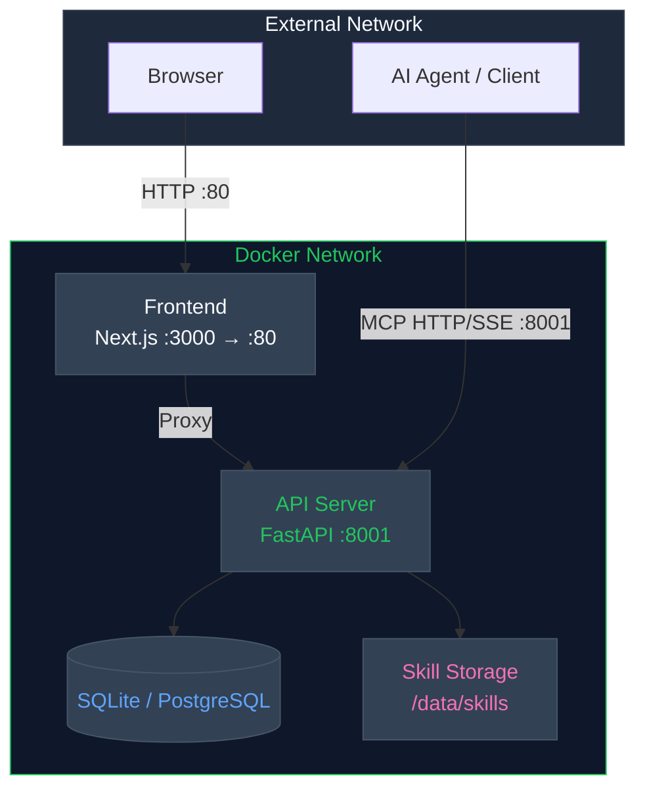
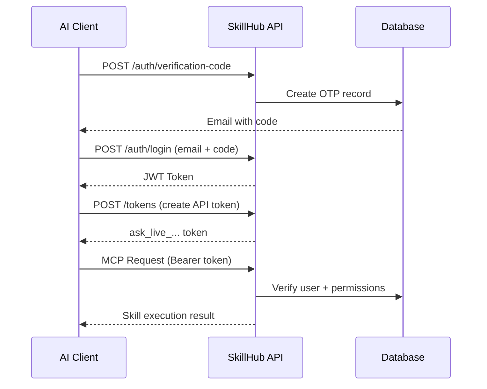

<p align="center">
  
</p>

<h1 align="center">Open SkillHub</h1>

<p align="center">
  <strong>MCP and Server-Execution Skills Management Platform for AI Agents</strong>
</p>

<p align="center">
  <a href="https://pypi.org/project/open-skillhub/"></a>
  <a href="https://pypi.org/project/open-skillhub/"></a>
  <a href="./LICENSE"></a>
  <a href="https://github.com/jiabai/open-skillhub-mcp"></a>
</p>

<p align="center">
  <a href="./README_ZH.md">简体中文</a> | English
</p>

---

## ✨ Overview

> MCP Edition: this repository preserves the server-execution and MCP-integrated product line.

**Open SkillHub MCP** is a **private Skills management SaaS platform** purpose-built for AI agents. This edition keeps the original server-side execution model, including MCP (Model Context Protocol) HTTP/SSE endpoints and service-side skill execution flows.

### Why Open SkillHub?

| Challenge | Solution |
|-----------|----------|
| Skills scattered across repositories | Centralized private skill storage |
| No access control for AI agents | JWT + API Token authentication |
| Manual skill deployment | Web console + MCP auto-discovery |
| No version tracking | Built-in versioning & rollback |

---

## 🚀 Quick Start

### Prerequisites

- **Python 3.10+**
- **Node.js 18+** (frontend, optional)

> **Database**: SQLite is used by default (zero-config). PostgreSQL 14+ is recommended for production — see [Deployment Guide](docs/deployment.md) for details.

### One-Command Docker Setup

```bash
git clone https://github.com/jiabai/open-skillhub-mcp.git
cd open-skillhub-mcp
cp backend/.env.example backend/.env
# Edit backend/.env — at minimum, change SECRET_KEY to a random 32+ char string
# Example: python -c "import secrets; print(secrets.token_urlsafe(32))"
docker compose up -d --build
```

**That's it!** Access the web console at `http://localhost`

### Manual Installation

```bash
# 1. Create virtual environment
uv venv
source .venv/bin/activate  # Linux/macOS
# .venv\Scripts\activate   # Windows

# 2. Install dependencies
uv sync --locked --extra dev

# 3. Configure environment
cp backend/.env.example backend/.env
# Edit backend/.env — at minimum, change SECRET_KEY to a random 32+ char string

# 4. Initialize database
uv run alembic -c backend/alembic.ini upgrade head

# 5. Start server
uv run uvicorn backend.api_app:app --host 0.0.0.0 --port 8001
```

For local development, the repository default is a project-local `.venv`. If you want `uv` to use a machine-level environment such as `D:\Code\.venv` on Windows, set `UV_PROJECT_ENVIRONMENT` locally before running `uv sync`; do not commit that machine-specific path into the repository.

---

## 🎯 Core Features

### Multi-Tenant Architecture

Every user gets an isolated skill space with JWT-based authentication and API token management (`ask_live_...` tokens for secure MCP access).

### Complete Skill Lifecycle

```
Upload ZIP → Parse SKILL.md → Version Control → Activate → MCP Discovery → Execute
     ↑                                                              |
     └────────────────── Rollback / Deactivate ←────────────────────┘
```

### Enterprise-Grade Security (Feature Flags)

The following features are controlled by feature flags and disabled by default. Enable them via environment variables in `backend/.env`.

- **RBAC** (`ENABLE_RBAC`): Role-based access control with fine-grained permissions
- **Organization Model** (`ENABLE_ORG_MODEL`): Enterprise → Team → User hierarchy
- **Audit Logging** (`ENABLE_AUDIT_LOG`): Full operation trail with export capability
- **SSO Integration** (`ENABLE_SSO`): JWT-based SSO authentication
- **LDAP** (`ENABLE_LDAP`): LDAP directory authentication
- **Email Verification** (`ENABLE_EMAIL_OTP_LOGIN`): OTP login and verification codes (enabled by default)

### MCP Integration (7 Tools)

Your AI agent can discover and execute skills via standard MCP protocol:

| Tool | Purpose |
|------|---------|
| `load_skill_metadata` | Scan available skills |
| `load_skill` | Load skill instructions (SKILL.md) |
| `read_reference_file` | Read reference files within skills |
| `run_shell_command` | Execute shell commands (whitelist-controlled) |
| `skill_list_resource` | MCP resource: list available skills |
| `skill_detail_resource` | MCP resource: get skill details |
| `execute_skill` | Execute skill with RBAC checks |

---

## 🏗️ Architecture



All external traffic enters through Frontend (port 80), which proxies API requests internally. AI agents can also connect directly to the API server (port 8001) via MCP protocol.

---

## 🔌 MCP Configuration

Connect your AI client to Open SkillHub:

```json
{
  "mcpServers": {
    "skillhub-mcp": {
      "type": "http",
      "url": "https://your-domain.com/mcp",
      "headers": {
        "Authorization": "Bearer ask_live_xxx..."
      }
    }
  }
}
```

### Authentication Flow



---

## 📁 Storage Structure

```
/data/skills/
├── {user_id_1}/
│   ├── pdf/
│   │   ├── SKILL.md          # Skill instructions
│   │   └── reference.md      # Reference documentation
│   └── xlsx/
│       └── SKILL.md
├── {user_id_2}/
│   └── pdf/
│       └── SKILL.md
└── ...
```

Each user's directory is fully isolated — users can only access their own skills.

---

## 📊 Services & Ports

| Service | Port | Description | Access |
|---------|------|-------------|--------|
| **Frontend** | 80 | Web Console (Next.js) | Public |
| **API Server** | 8001 | Backend API (FastAPI) | Public (MCP) |

> **Note**: The default Docker setup uses SQLite (no separate database service). To use PostgreSQL, add a `db` service to `docker-compose.yml` — see [Deployment Guide](docs/deployment.md).

---

## 📚 Documentation

| Resource | Description |
|----------|-------------|
| [Backend Architecture](docs/backend-design/) | System design & architecture docs |
| [Deployment Guide](docs/deployment.md) | Production setup instructions |
| [MCP Tools](docs/tools.md) | Tool specifications & usage |
| [Frontend Design](docs/frontend-design/) | UI/UX design specs |
| [User Runtime Environment](docs/user-runtime-environment/) | Runtime environment design docs |

---

## 🔐 Key API Endpoints

<details>
<summary><strong>Authentication</strong></summary>

- `POST /api/v1/auth/verification-code` - Send email code
- `POST /api/v1/auth/register` - User registration
- `POST /api/v1/auth/login` - User login
- `POST /api/v1/auth/refresh` - Refresh access token
- `POST /api/v1/auth/sso/prepare` - Prepare SSO authentication
- `POST /api/v1/auth/sso/login` - SSO authentication
- `POST /api/v1/auth/ldap/login` - LDAP authentication
- `POST /api/v1/auth/logout` - User logout

</details>

<details>
<summary><strong>Skill Management</strong></summary>

- `GET /api/v1/skills` - List all skills
- `GET /api/v1/skills/public` - List public skills
- `GET /api/v1/skills/public/{id}` - Get public skill details
- `GET /api/v1/skills/cache-policy` - Get skill cache policy
- `POST /api/v1/skills` - Create new skill
- `POST /api/v1/skills/upload` - Upload skill ZIP
- `POST /api/v1/skills/download` - Download skill package (encrypted)
- `GET /api/v1/skills/{id}` - Get skill details
- `PUT /api/v1/skills/{id}` - Update skill
- `DELETE /api/v1/skills/{id}` - Delete skill
- `POST /api/v1/skills/{id}/reference` - Add reference file
- `POST /api/v1/skills/{id}/clone` - Clone skill
- `PUT /api/v1/skills/{id}/pin` - Pin skill
- `PUT /api/v1/skills/{id}/unpin` - Unpin skill
- `POST /api/v1/skills/{id}/activate` - Activate skill
- `POST /api/v1/skills/{id}/deactivate` - Deactivate skill
- `GET /api/v1/skills/{id}/versions` - Version history
- `GET /api/v1/skills/{id}/versions/diff` - Version diff
- `GET /api/v1/skills/{id}/versions/{version}` - Get specific version
- `GET /api/v1/skills/{id}/versions/{version}/install-instructions` - Install instructions
- `POST /api/v1/skills/{id}/versions/{version}/rollback` - Rollback to version
- `GET /api/v1/skills/{id}/files` - List skill files
- `GET /api/v1/skills/{id}/files/{path}` - Read skill file

</details>

<details>
<summary><strong>Tokens</strong></summary>

- `GET /api/v1/tokens` - List API tokens
- `POST /api/v1/tokens` - Create API token
- `DELETE /api/v1/tokens/{id}` - Revoke API token

</details>

<details>
<summary><strong>Dashboard</strong></summary>

- `GET /api/v1/dashboard/overview` - Dashboard overview stats
- `POST /api/v1/dashboard/metrics/cleanup` - Cleanup old metrics
- `POST /api/v1/dashboard/metrics/reset-24h` - Reset 24h metrics

</details>

<details>
<summary><strong>Audit</strong></summary>

- `GET /api/v1/audit/logs` - Query audit logs
- `POST /api/v1/audit/logs/export` - Export logs

</details>

For full API docs, visit `/docs` when running the server (FastAPI auto-generated).

---

## 🛠️ Tech Stack

| Layer | Technology |
|-------|-----------|
| Backend | Python 3.10+, FastAPI, SQLAlchemy (async), FlowLLM |
| Database | SQLite (default) / PostgreSQL 14+ (via asyncpg) |
| Frontend | Next.js 14, TypeScript, Tailwind CSS, shadcn/ui |
| Auth | JWT (PyJWT), OTP email verification, SSO, LDAP |
| Storage | Local filesystem / S3 (boto3) |
| Deployment | Docker Compose, Nginx reverse proxy |
| Protocol | MCP (HTTP + SSE) |
| Logging | Loguru |

---

## 📄 License

This project is licensed under **Apache License 2.0** — see [LICENSE](./LICENSE) for details.

---

## 🤝 Contributing

We welcome contributions! Please feel free to submit issues and pull requests.

<p align="center">
  <sub>Built with care for the AI developer community</sub>
</p>

