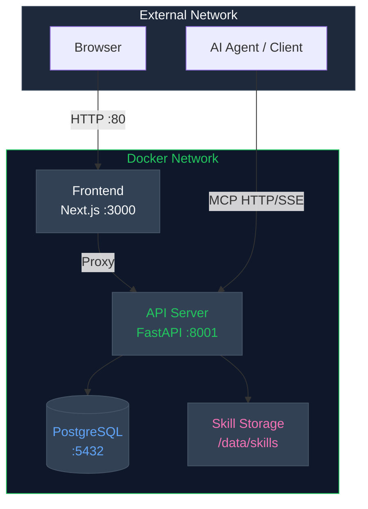
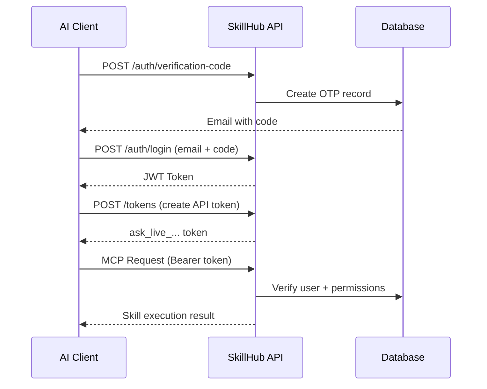

<p align="center">
  
</p>

<h1 align="center">Open SkillHub</h1>

<p align="center">
  <strong>Private Skills Management Platform for AI Agents</strong>
</p>

<p align="center">
  <a href="https://pypi.org/project/open-skillhub/"></a>
  <a href="https://pypi.org/project/open-skillhub/"></a>
  <a href="./LICENSE"></a>
  <a href="https://github.com/zouyingcao/open-skillhub"></a>
</p>

<p align="center">
  <a href="./README_ZH.md">简体中文</a> | English
</p>

---

## ✨ Overview

**Open SkillHub** is a **private Skills management SaaS platform** purpose-built for AI agents. It delivers a complete "upload → manage → execute" workflow with multi-tenant isolation, a modern web console, and native MCP (Model Context Protocol) HTTP/SSE endpoints.

### Why Open SkillHub?

| Challenge | Solution |
|-----------|----------|
| Skills scattered across repositories | Centralized private skill storage |
| No access control for AI agents | JWT + API Token authentication |
| Manual skill deployment | Web console + MCP auto-discovery |
| No version tracking | Built-in versioning & rollback |

---

## 🚀 Quick Start

### Prerequisites

- **Python 3.10+**
- **PostgreSQL 14+** (production)
- **Node.js 18+** (frontend, optional)

### One-Command Docker Setup

```bash
git clone https://github.com/zouyingcao/open-skillhub.git
cd open-skillhub
cp backend/.env.example backend/.env
docker compose up -d --build
```

**That's it!** Access the web console at `http://localhost`

### Manual Installation

```bash
# 1. Create virtual environment
python -m venv .venv
source .venv/bin/activate  # Linux/macOS
# .venv\Scripts\activate   # Windows

# 2. Install dependencies
pip install -e ".[dev]"

# 3. Configure environment
cp backend/.env.example backend/.env
# Edit backend/.env with your settings

# 4. Initialize database
alembic upgrade head

# 5. Start server
uvicorn backend.api_app:app --host 0.0.0.0 --port 8000
```

---

## 🎯 Core Features

### Multi-Tenant Architecture

Every user gets an isolated skill space with JWT-based authentication and API token management (`ask_live_...` tokens for secure MCP access).

### Complete Skill Lifecycle

```
Upload ZIP → Parse SKILL.md → Version Control → Activate → MCP Discovery → Execute
     ↑                                                              |
     └────────────────── Rollback / Deactivate ←────────────────────┘
```

### Enterprise-Grade Security

- **RBAC**: Role-based access control with fine-grained permissions
- **Organization Model**: Enterprise → Team → User hierarchy
- **Audit Logging**: Full operation trail with export capability
- **SSO Integration**: JWT-based SSO with LDAP support
- **Email Verification**: OTP login and verification codes

### MCP Integration (7 Tools)

Your AI agent can discover and execute skills via standard MCP protocol:

| Tool | Purpose |
|------|---------|
| `load_skill_metadata` | Scan available skills |
| `load_skill` | Load skill instructions (SKILL.md) |
| `read_reference_file` | Read reference files within skills |
| `run_shell_command` | Execute shell commands (whitelist-controlled) |
| `skill_list_resource` | Resource endpoint for skill listing |
| `skill_detail_resource` | Resource endpoint for skill details |
| `execute_skill` | Execute skill with RBAC checks |

---

## 🏗️ Architecture



All external traffic enters through Frontend (port 80), which proxies API requests internally.

---

## 🔌 MCP Configuration

Connect your AI client to Open SkillHub:

```json
{
  "mcpServers": {
    "skillhub-mcp": {
      "type": "http",
      "url": "https://your-domain.com/mcp",
      "headers": {
        "Authorization": "Bearer ask_live_xxx..."
      }
    }
  }
}
```

### Authentication Flow



---

## 📁 Storage Structure

```
/data/skills/
├── {user_id_1}/
│   ├── pdf/
│   │   ├── SKILL.md          # Skill instructions
│   │   └── reference.md      # Reference documentation
│   └── xlsx/
│       └── SKILL.md
├── {user_id_2}/
│   └── pdf/
│       └── SKILL.md
└── ...
```

Each user's directory is fully isolated — users can only access their own skills.

---

## 📊 Services & Ports

| Service | Port | Description | Access |
|---------|------|-------------|--------|
| **Frontend** | 80 | Web Console (Next.js) | Public |
| **API Server** | 8001 | Backend API (FastAPI) | Internal |
| **PostgreSQL** | 5432 | Database | Internal |
| **Adminer** | 18080 | Database Admin UI | Internal |

---

## 📚 Documentation

| Resource | Description |
|----------|-------------|
| [Backend Architecture](docs/backend-design/) | System design & architecture docs |
| [Deployment Guide](docs/deployment.md) | Production setup instructions |
| [MCP Tools](docs/tools.md) | Tool specifications & usage |
| [Frontend Design](docs/frontend-design/) | UI/UX design specs |

---

## 🔐 Key API Endpoints

<details>
<summary><strong>Authentication</strong></summary>

- `POST /api/v1/auth/verification-code` - Send email code
- `POST /api/v1/auth/register` - User registration
- `POST /api/v1/auth/login` - User login
- `POST /api/v1/auth/sso/login` - SSO authentication
- `POST /api/v1/auth/ldap/login` - LDAP authentication

</details>

<details>
<summary><strong>Skill Management</strong></summary>

- `GET /api/v1/skills` - List all skills
- `POST /api/v1/skills` - Create new skill
- `POST /api/v1/skills/upload` - Upload skill ZIP
- `GET /api/v1/skills/{id}/versions` - Version history
- `POST /api/v1/skills/{id}/versions/{version}/rollback` - Rollback
- `POST /api/v1/skills/{id}/activate|deactivate` - Toggle status

</details>

<details>
<summary><strong>Tokens & Audit</strong></summary>

- `GET/POST /api/v1/tokens` - Manage API tokens
- `GET /api/v1/audit/logs` - Query audit logs
- `POST /api/v1/audit/logs/export` - Export logs

</details>

For full API docs, visit `/docs` when running the server (FastAPI auto-generated).

---

## 🛠️ Tech Stack

| Layer | Technology |
|-------|-----------|
| Backend | Python 3.10+, FastAPI, SQLAlchemy (async) |
| Database | PostgreSQL 14+ (via asyncpg) |
| Frontend | Next.js 14+, TypeScript, Tailwind CSS |
| Auth | JWT (PyJWT), OTP email verification |
| Deployment | Docker Compose, Nginx reverse proxy |
| Protocol | MCP (HTTP + SSE) |

---

## 📄 License

This project is licensed under **Apache License 2.0** — see [LICENSE](./LICENSE) for details.

---

## 🤝 Contributing

We welcome contributions! Please feel free to submit issues and pull requests.

<p align="center">
  <sub>Built with care for the AI developer community</sub>
</p>
