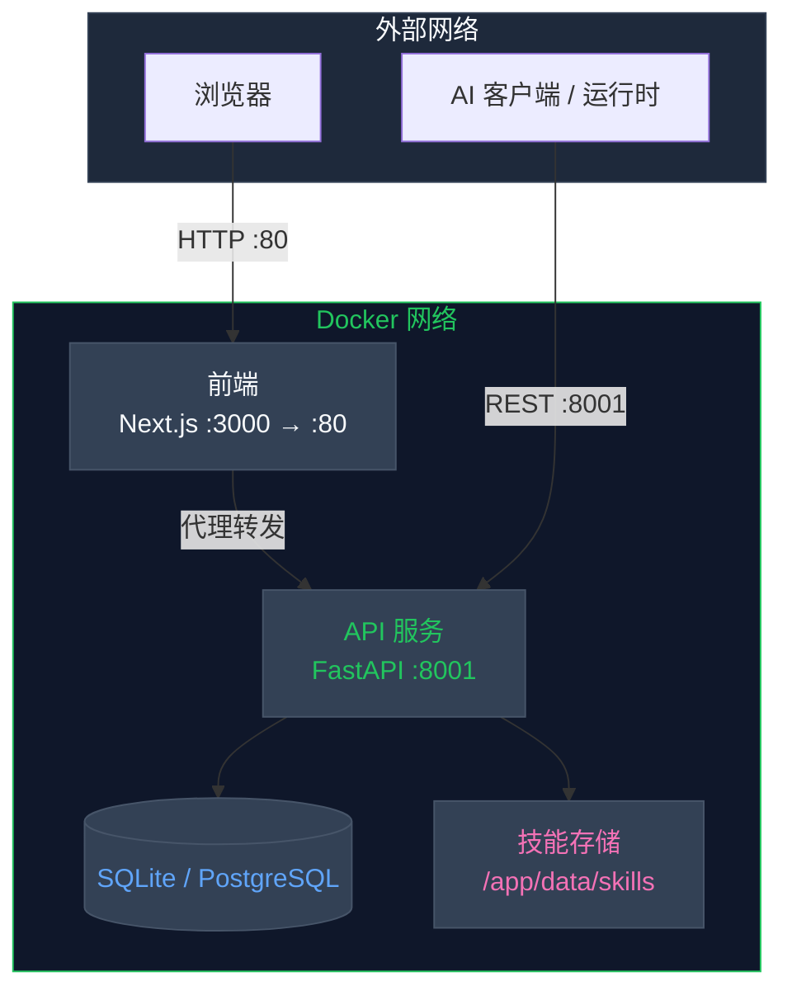
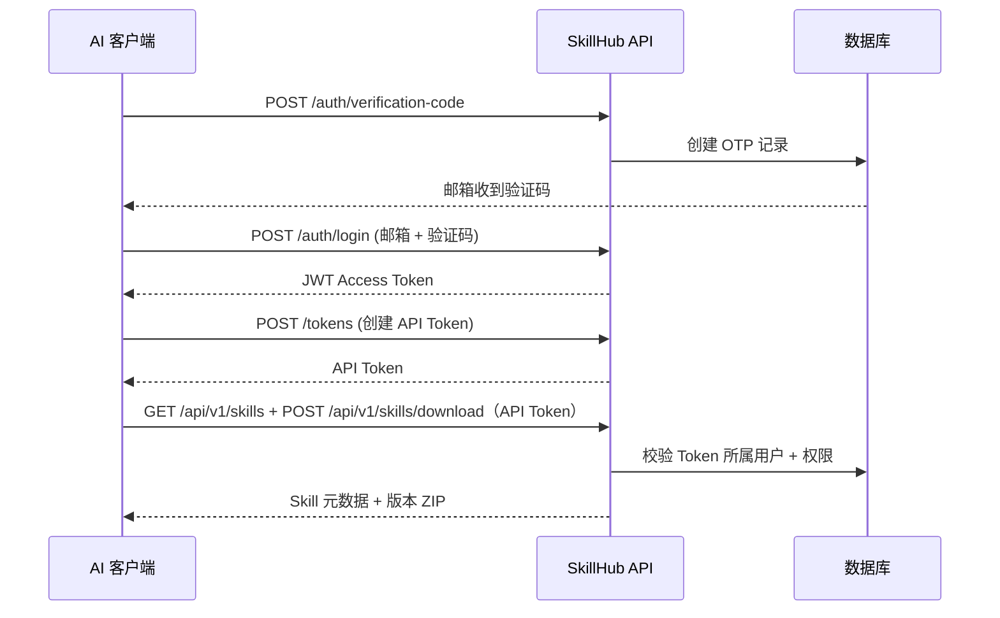

<p align="center">
  
</p>

<h1 align="center">Open SkillHub</h1>

<p align="center">
  <strong>面向 AI Agent 的 Skills 管理与分发 SaaS 平台</strong>
</p>

<p align="center">
  <a href="https://pypi.org/project/open-skillhub/"></a>
  <a href="https://pypi.org/project/open-skillhub/"></a>
  <a href="./LICENSE"></a>
  <a href="https://github.com/jiabai/open-skillhub"></a>
</p>

<p align="center">
  简体中文 | <a href="./README.md">English</a>
</p>

---

## ✨ 项目简介

**Open SkillHub** 是一个**私有化 Skills 管理 SaaS 平台**，专为 AI Agent 打造。它聚焦主流的「上传 → 管理 → 下载」闭环能力，提供多租户隔离、可视化 Web 控制台，以及面向客户端运行时的 REST 分发接口。

### 为什么选择 Open SkillHub？

| 痛点 | 解决方案 |
|------|---------|
| 技能散落在各处仓库 | 集中式私有技能存储 |
| AI Agent 无访问控制 | Web 用 JWT，客户端用 API Token |
| 手动分发技能繁琐 | Web 控制台 + REST 下载分发 |
| 缺乏版本追踪 | 内置版本管理与回滚 |

---

## 🚀 快速开始

### 环境要求

- **Python 3.10+**
- **Node.js 18+**（前端，可选）

> **数据库**：默认使用 SQLite（零配置开箱即用）。生产环境推荐 PostgreSQL 14+，详见[部署指南](docs/deployment.md)。

### Docker 部署（推荐）

```bash
git clone https://github.com/jiabai/open-skillhub.git
cd open-skillhub
cp backend/.env.example backend/.env
# 编辑 backend/.env — 至少需要修改 SECRET_KEY 为 32 位以上的随机字符串
# 示例：python -c "import secrets; print(secrets.token_urlsafe(32))"
docker compose up -d --build migrate
docker compose up -d api frontend
```

第一条命令会使用后端镜像执行 Alembic 迁移；第二条命令会在迁移成功后启动 API 和前端。完成后访问 `http://localhost` 即可打开 Web 控制台。

### 手动安装

```bash
# 1. 创建虚拟环境
uv venv
source .venv/bin/activate  # Linux/macOS
# .venv\Scripts\activate   # Windows

# 2. 安装依赖
uv sync --locked --extra dev

# 3. 配置环境变量
cp backend/.env.example backend/.env
# 编辑 backend/.env — 至少需要修改 SECRET_KEY 为 32 位以上的随机字符串

# 4. 初始化数据库
uv run alembic -c backend/alembic.ini upgrade head

# 5. 启动服务
uv run uvicorn backend.api_app:app --host 0.0.0.0 --port 8001
```

浠撳簱榛樿浣跨敤椤圭洰鍐?`.venv`锛岃繖鏇撮€傚悎 Linux 閮ㄧ讲銆丏ocker 鍜?CI銆傚鏋滀綘鍦?Windows 鏈哄櫒涓婂笇鏈涘鐢?`D:\Code\.venv` 杩欑鏈哄櫒绾ц櫄鎷熺幆澧冿紝璇峰彧鍦ㄦ湰鍦拌缃?`UV_PROJECT_ENVIRONMENT`锛屼笉瑕佹妸璇ョ粷瀵硅矾寰勫啓鍏ヤ粨搴撱€?

---

## 🎯 核心功能

### 多租户架构

每位用户拥有独立的技能空间，并采用清晰的认证边界：Web 控制台使用 JWT，客户端分发访问使用 API Token。

### 完整的技能生命周期

```
上传 ZIP → 解析 SKILL.md → 版本管理 → 启用 → 下载
     ↑                                   |
     └────────────────── 回滚 / 停用 ←───┘
```

### 企业级安全保障（后端能力开关）

以下能力由后端环境变量控制，并通过 `/api/v1/runtime-config` 下发给前端控制台。

- **RBAC** (`ENABLE_RBAC`) — 基于角色的细粒度权限管理
- **组织架构模型** (`ENABLE_ORG_MODEL`) — 企业 → 团队 → 用户三级层级
- **审计日志** (`ENABLE_AUDIT_LOG`) — 完整操作记录，支持导出
- **SSO 单点登录** (`ENABLE_SSO`) — 基于 OIDC Authorization Code + PKCE
- **LDAP** (`ENABLE_LDAP`) — LDAP 目录认证
- **邮箱验证** (`ENABLE_EMAIL_OTP_LOGIN`) — OTP 登录 + 验证码校验（默认启用）

前端不再单独维护一套业务能力开关，页面功能是否展示以服务端下发的 runtime capability contract 为准。

### REST 优先的技能分发

默认产品路径是集中管理 Skill，并通过 REST 向客户端分发：

| 能力 | 用途 |
|------|------|
| 技能管理 API | 创建、更新、启用和版本化 Skill |
| 技能下载 API | 下载指定版本 ZIP |
| 认证与 API Token | 控制客户端可访问的 Skill |
| Web 控制台 | 浏览、管理和分发 Skill |

---

## 🏗️ 架构图



所有外部流量通过前端（端口 80）进入，由前端内部代理转发 API 请求。客户端运行时也可直接连接 API 服务（端口 8001），完成认证、查询 Skill 元数据并下载版本包。

---

## 🔌 客户端运行时接入流程

客户端运行时通过 REST 接入 Open SkillHub：

1. 登录 Web 控制台并获取 JWT Access Token
2. 调用 `/api/v1/tokens` 创建 API Token
3. 使用 API Token 查询 Skill 元数据并调用 `/api/v1/skills/download` 下载指定版本
4. 在客户端本地按自身运行时策略处理已下载内容

### 认证流程



---

## 📁 存储结构

```
/app/data/skills/
├── {user_id_1}/
│   ├── pdf/
│   │   ├── SKILL.md          # 技能指令文件
│   │   └── reference.md      # 参考文档
│   └── xlsx/
│       └── SKILL.md
├── {user_id_2}/
│   └── pdf/
│       └── SKILL.md
└── ...
```

每个用户目录完全隔离，仅能访问自己的技能空间，确保数据安全。

---

## 📊 服务端口说明

| 服务 | 端口 | 说明 | 访问范围 |
|------|------|------|---------|
| **前端** | 80 | Web 控制台 (Next.js) | 对外开放 |
| **API 服务** | 8001 | 后端 API (FastAPI) | 对外开放（REST） |

> **注意**：默认 Docker 部署使用 SQLite，无需额外数据库服务。如需使用 PostgreSQL，请在 `docker-compose.yml` 中添加 `db` 服务，详见[部署指南](docs/deployment.md)。

---

## 📚 文档资源

| 资源 | 说明 |
|------|------|
| [后端架构设计](docs/backend-design/) | 系统架构与技术设计文档 |
| [部署指南](docs/deployment.md) | 生产环境部署教程 |
| [前端设计规范](docs/frontend-design/) | UI/UX 设计规格 |
| [用户运行时环境](docs/user-runtime-environment/) | 运行时环境设计文档 |

---

## 🔐 核心 API 端点

<details>
<summary><strong>认证模块</strong></summary>

- `POST /api/v1/auth/verification-code` — 发送邮箱验证码
- `POST /api/v1/auth/register` — 用户注册
- `POST /api/v1/auth/login` — 用户登录
- `POST /api/v1/auth/refresh` — 刷新访问令牌
- `GET /api/v1/auth/sso/authorize` — 发起 OIDC Authorization Code + PKCE 流程
- `GET /api/v1/auth/sso/callback` — 完成 OIDC 回调并签发应用令牌
- `POST /api/v1/auth/ldap/login` — LDAP 登录
- `POST /api/v1/auth/logout` — 用户登出

</details>

<details>
<summary><strong>技能管理</strong></summary>

- `GET /api/v1/skills` — 获取技能列表（仅 API Token）
- `GET /api/v1/skills/public` — 获取公开技能列表
- `GET /api/v1/skills/public/{id}` — 获取公开技能详情
- `GET /api/v1/skills/cache-policy` — 获取技能缓存策略
- `POST /api/v1/skills` — 创建新技能
- `POST /api/v1/skills/upload` — 上传技能 ZIP 包
- `POST /api/v1/skills/download` — 下载技能包（加密，仅 API Token）
- `GET /api/v1/skills/{id}` — 获取技能详情（仅 API Token）
- `PUT /api/v1/skills/{id}` — 更新技能
- `DELETE /api/v1/skills/{id}` — 删除技能
- `POST /api/v1/skills/{id}/reference` — 添加参考文件
- `POST /api/v1/skills/{id}/clone` — 克隆技能
- `PUT /api/v1/skills/{id}/pin` — 置顶技能
- `PUT /api/v1/skills/{id}/unpin` — 取消置顶
- `POST /api/v1/skills/{id}/activate` — 启用技能
- `POST /api/v1/skills/{id}/deactivate` — 停用技能
- `GET /api/v1/skills/{id}/versions` — 版本历史（仅 API Token）
- `GET /api/v1/skills/{id}/versions/diff` — 版本差异对比
- `GET /api/v1/skills/{id}/versions/{version}` — 获取指定版本（仅 API Token）
- `GET /api/v1/skills/{id}/versions/{version}/install-instructions` — 安装说明（仅 API Token）
- `POST /api/v1/skills/{id}/versions/{version}/rollback` — 版本回滚
- `GET /api/v1/skills/{id}/files` — 列出技能文件
- `GET /api/v1/skills/{id}/files/{path}` — 读取技能文件

</details>

<details>
<summary><strong>Token 管理</strong></summary>

- `GET /api/v1/tokens` — 获取 Token 列表
- `POST /api/v1/tokens` — 创建 API Token
- `DELETE /api/v1/tokens/{id}` — 撤销 API Token

</details>

<details>
<summary><strong>仪表盘</strong></summary>

- `GET /api/v1/dashboard/overview` — 仪表盘概览统计
- `POST /api/v1/dashboard/metrics/cleanup` — 清理历史指标
- `POST /api/v1/dashboard/metrics/reset-24h` — 重置 24 小时指标

</details>

<details>
<summary><strong>审计日志</strong></summary>

- `GET /api/v1/audit/logs` — 查询审计日志
- `POST /api/v1/audit/logs/export` — 导出日志

</details>

完整 API 文档：启动服务后访问 `/docs`（FastAPI 自动生成）

---

## 🛠️ 技术栈

| 层面 | 技术 |
|------|------|
| 后端 | Python 3.10+, FastAPI, SQLAlchemy (async) |
| 数据库 | SQLite（默认）/ PostgreSQL 14+ (asyncpg) |
| 前端 | Next.js 14, TypeScript, Tailwind CSS, shadcn/ui |
| 认证 | JWT (PyJWT), OTP 邮箱验证, SSO, LDAP |
| 存储 | 本地文件系统 / S3 (boto3) |
| 部署 | Docker Compose, Nginx 反向代理 |
| 协议 | REST (HTTP) |
| 日志 | Loguru |

---

## 📄 许可证

本项目采用 **Apache License 2.0** 开源协议 —— 详情请参阅 [LICENSE](./LICENSE) 文件。

---

## 🤝 参与贡献

欢迎提交 Issue 和 Pull Request！

<p align="center">
  <sub>为 AI 开发者社区用心构建</sub>
</p>

