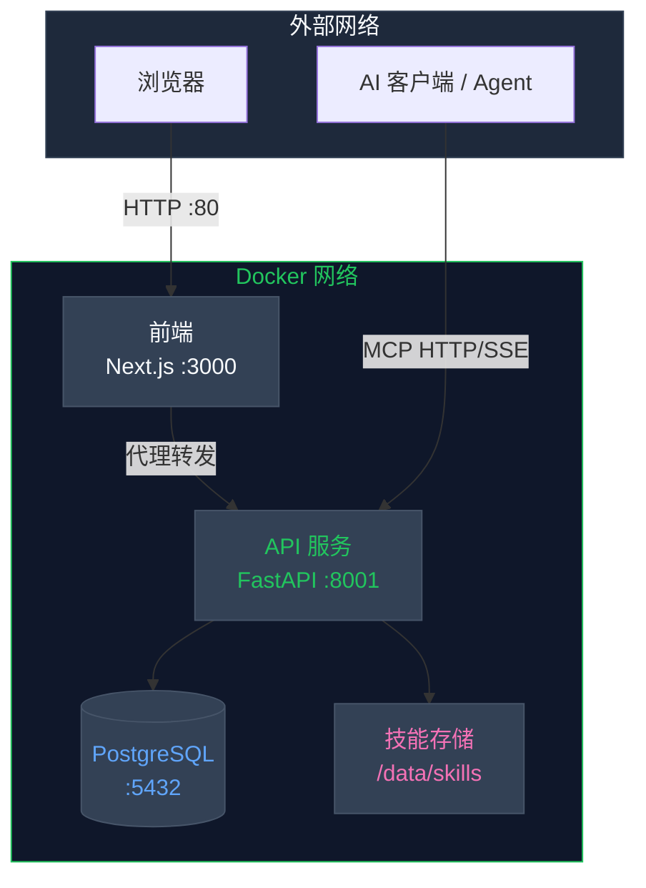
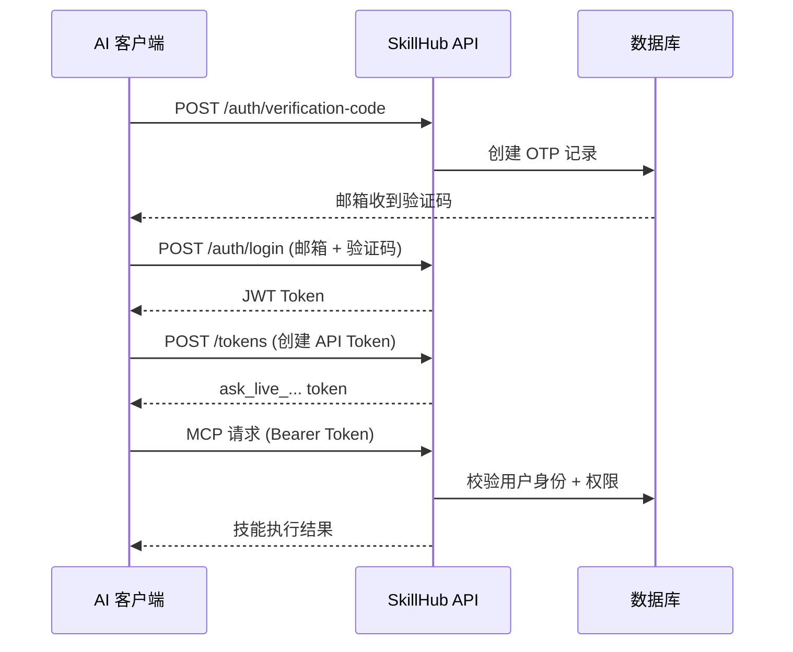

<p align="center">
  
</p>

<h1 align="center">Open SkillHub</h1>

<p align="center">
  <strong>面向 AI Agent 的私有化技能管理 SaaS 平台</strong>
</p>

<p align="center">
  <a href="https://pypi.org/project/open-skillhub/"></a>
  <a href="https://pypi.org/project/open-skillhub/"></a>
  <a href="./LICENSE"></a>
  <a href="https://github.com/zouyingcao/open-skillhub"></a>
</p>

<p align="center">
  简体中文 | <a href="./README.md">English</a>
</p>

---

## ✨ 项目简介

**Open SkillHub** 是一个**私有化 Skills 管理 SaaS 平台**，专为 AI Agent 打造。它提供完整的「上传 → 管理 → 调用」闭环能力，支持多租户隔离、可视化 Web 控制台，以及原生 MCP (Model Context Protocol) HTTP/SSE 接入。

### 为什么选择 Open SkillHub？

| 痛点 | 解决方案 |
|------|---------|
| 技能散落在各处仓库 | 集中式私有技能存储 |
| AI Agent 无访问控制 | JWT + API Token 双重认证 |
| 手动部署技能繁琐 | Web 控制台 + MCP 自动发现 |
| 缺乏版本追踪 | 内置版本管理与回滚 |

---

## 🚀 快速开始

### 环境要求

- **Python 3.10+**
- **PostgreSQL 14+**（生产环境）
- **Node.js 18+**（前端，可选）

### 一键 Docker 部署（推荐）

```bash
git clone https://github.com/zouyingcao/open-skillhub.git
cd open-skillhub
cp backend/.env.example backend/.env
docker compose up -d --build
```

**完成！** 访问 `http://localhost` 即可打开 Web 控制台。

### 手动安装

```bash
# 1. 创建虚拟环境
python -m venv .venv
source .venv/bin/activate  # Linux/macOS
# .venv\Scripts\activate   # Windows

# 2. 安装依赖
pip install -e ".[dev]"

# 3. 配置环境变量
cp backend/.env.example backend/.env
# 编辑 backend/.env 填入你的配置

# 4. 初始化数据库
alembic upgrade head

# 5. 启动服务
uvicorn backend.api_app:app --host 0.0.0.0 --port 8000
```

---

## 🎯 核心功能

### 多租户架构

每位用户拥有独立的技能空间，基于 JWT 身份认证与 API Token 管理（`ask_live_...` Token 安全访问 MCP）。

### 完整的技能生命周期

```
上传 ZIP → 解析 SKILL.md → 版本管理 → 启用 → MCP 发现 → 执行
     ↑                                                |
     └──────────────── 回滚 / 停用 ←───────────────────┘
```

### 企业级安全保障

- **RBAC 权限控制** — 基于角色的细粒度权限管理
- **组织架构模型** — 企业 → 团队 → 用户三级层级
- **审计日志** — 完整操作记录，支持导出
- **SSO 单点登录** — 基于 JWT 的 SSO，支持 LDAP
- **邮箱验证** — OTP 登录 + 验证码校验

### MCP 集成（7 个工具）

AI Agent 通过标准 MCP 协议自动发现和执行技能：

| 工具 | 用途 |
|------|------|
| `load_skill_metadata` | 扫描可用技能列表 |
| `load_skill` | 加载技能指令（SKILL.md） |
| `read_reference_file` | 读取技能内参考文件 |
| `run_shell_command` | 执行 Shell 命令（白名单控制） |
| `skill_list_resource` | 资源端点：技能列表 |
| `skill_detail_resource` | 资源端点：技能详情 |
| `execute_skill` | 执行技能（含 RBAC 检查） |

---

## 🏗️ 架构图



所有外部流量通过前端（端口 80）进入，由前端内部代理转发 API 请求。

---

## 🔌 MCP 接入配置

在 AI 客户端中配置 Open SkillHub：

```json
{
  "mcpServers": {
    "skillhub-mcp": {
      "type": "http",
      "url": "https://your-domain.com/mcp",
      "headers": {
        "Authorization": "Bearer ask_live_xxx..."
      }
    }
  }
}
```

### 认证流程



---

## 📁 存储结构

```
/data/skills/
├── {user_id_1}/
│   ├── pdf/
│   │   ├── SKILL.md          # 技能指令文件
│   │   └── reference.md      # 参考文档
│   └── xlsx/
│       └── SKILL.md
├── {user_id_2}/
│   └── pdf/
│       └── SKILL.md
└── ...
```

每个用户目录完全隔离，仅能访问自己的技能空间，确保数据安全。

---

## 📊 服务端口说明

| 服务 | 端口 | 说明 | 访问范围 |
|------|------|------|---------|
| **前端** | 80 | Web 控制台 (Next.js) | 对外开放 |
| **API 服务** | 8001 | 后端 API (FastAPI) | 仅内网 |
| **PostgreSQL** | 5432 | 数据库 | 仅内网 |
| **Adminer** | 18080 | 数据库管理界面 | 仅内网 |

---

## 📚 文档资源

| 资源 | 说明 |
|------|------|
| [后端架构设计](docs/backend-design/) | 系统架构与技术设计文档 |
| [部署指南](docs/deployment.md) | 生产环境部署教程 |
| [MCP 工具文档](docs/tools.md) | 工具规格与使用说明 |
| [前端设计规范](docs/frontend-design/) | UI/UX 设计规格 |

---

## 🔐 核心 API 端点

<details>
<summary><strong>认证模块</strong></summary>

- `POST /api/v1/auth/verification-code` — 发送邮箱验证码
- `POST /api/v1/auth/register` — 用户注册
- `POST /api/v1/auth/login` — 用户登录
- `POST /api/v1/auth/sso/login` — SSO 认证
- `POST /api/v1/auth/ldap/login` — LDAP 登录

</details>

<details>
<summary><strong>技能管理</strong></summary>

- `GET /api/v1/skills` — 获取技能列表
- `POST /api/v1/skills` — 创建新技能
- `POST /api/v1/skills/upload` — 上传技能 ZIP 包
- `GET /api/v1/skills/{id}/versions` — 版本历史
- `POST /api/v1/skills/{id}/versions/{version}/rollback` — 版本回滚
- `POST /api/v1/skills/{id}/activate|deactivate` — 启用/停用

</details>

<details>
<summary><strong>Token 与审计</strong></summary>

- `GET/POST /api/v1/tokens` — 管理 API Token
- `GET /api/v1/audit/logs` — 查询审计日志
- `POST /api/v1/audit/logs/export` — 导出日志

</details>

完整 API 文档：启动服务后访问 `/docs`（FastAPI 自动生成）

---

## 🛠️ 技术栈

| 层面 | 技术 |
|------|------|
| 后端 | Python 3.10+, FastAPI, SQLAlchemy (async) |
| 数据库 | PostgreSQL 14+ (asyncpg) |
| 前端 | Next.js 14+, TypeScript, Tailwind CSS |
| 认证 | JWT (PyJWT), OTP 邮箱验证 |
| 部署 | Docker Compose, Nginx 反向代理 |
| 协议 | MCP (HTTP + SSE) |

---

## 📄 许可证

本项目采用 **Apache License 2.0** 开源协议 —— 详情请参阅 [LICENSE](./LICENSE) 文件。

---

## 🤝 参与贡献

欢迎提交 Issue 和 Pull Request！

<p align="center">
  <sub>为 AI 开发者社区用心构建</sub>
</p>
