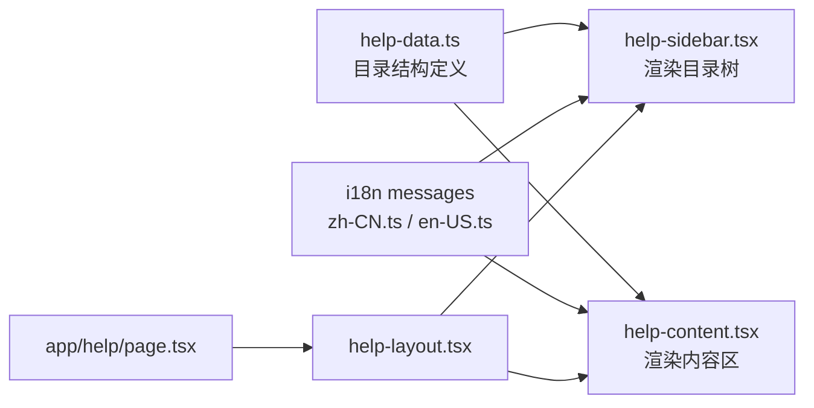
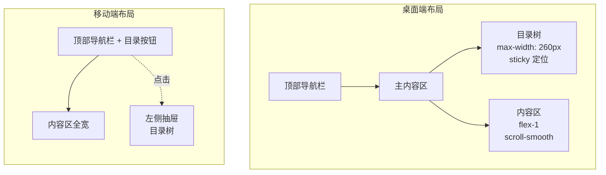

# Help Center Design Document

## 1. 整体架构

帮助中心是一个纯前端功能，无需后端 API 支持。所有帮助内容由 i18n 字典提供，目录结构由前端数据文件驱动。

### 1.1 数据流



### 1.2 路由与导航集成

```mermaid
graph TD
    User[用户] --> Header[AppShell 顶部导航栏]
    Header --> HelpIcon[HelpCircle 图标按钮]
    HelpIcon --> Route[/help 路由]
    Route --> Page[help/page.tsx]
    Page --> Layout[help-layout.tsx]
    Layout --> Sidebar[help-sidebar.tsx<br/>左侧目录]
    Layout --> Content[help-content.tsx<br/>右侧内容]
```

## 2. 页面布局

采用经典文档布局：桌面端左侧固定目录 + 右侧可滚动内容；移动端目录折叠为抽屉。



## 3. 目录与锚点设计

目录数据采用树形结构，每个节点包含 `id`、`titleKey`、`level`、`children`。`id` 同时作为锚点标识符。

| 章节 | ID | 层级 |
|------|-----|------|
| 快速入门 | `getting-started` | 1 |
| SkillDrive 是什么 | `what-is-skilldrive` | 2 |
| 注册与登录 | `register-and-login` | 2 |
| 界面导览 | `ui-overview` | 2 |
| Skills | `skills` | 1 |
| 公共 Skills | `public-skills` | 2 |
| 我的 Skills | `my-skills` | 2 |
| 上传 Skill | `upload-skill` | 2 |
| 版本管理 | `version-management` | 2 |
| 令牌与客户端 | `tokens` | 1 |
| 创建 API 令牌 | `create-token` | 2 |
| 连接桌面客户端 | `desktop-client` | 2 |
| 令牌生命周期 | `token-lifecycle` | 2 |
| 账户与安全 | `account-security` | 1 |
| 更新个人信息 | `update-profile` | 2 |
| 绑定邮箱 | `bind-email` | 2 |
| 删除账户 | `delete-account` | 2 |
| 常见问题 | `faq` | 1 |
| 引用和克隆的区别 | `faq-reference-vs-clone` | 2 |
| 令牌丢失怎么办 | `faq-lost-token` | 2 |
| Skill 上传失败 | `faq-upload-failed` | 2 |

## 4. 组件设计

### 4.1 HelpLayout

- 接收 `items: HelpSection[]` 和 `dictionary: AppDictionary['help']`
- 桌面端：`flex` 布局，左侧 `w-64 shrink-0`，右侧 `flex-1`
- 移动端：隐藏侧边栏，通过 Sheet 抽屉展示
- 使用 `ScrollArea` 包裹目录树（若内容超长）

### 4.2 HelpSidebar

- 接收 `items`、`activeId`、`onSelect`
- 渲染层级缩进：`level === 2` 时左侧加 `pl-4`
- 当前激活项样式：`bg-primary text-primary-foreground`
- 非激活项样式：`text-muted-foreground hover:bg-muted`
- 移动端包裹在 Sheet 中，通过按钮触发

### 4.3 HelpContent

- 接收 `items` 和字典
- 遍历 `items`，为每个 item 渲染带 `id` 的 section
- 使用 `IntersectionObserver` 监听当前可见 section，回传 `activeId`
- 标题使用 `h2`（level 1）和 `h3`（level 2），正文使用 `p` + `text-muted-foreground`
- 段落间保持 `mb-4` 间距

### 4.4 导航入口（AppShell 修改）

在 `ThemeToggle` 旁边新增：

```tsx
<Link href="/help" aria-label={dictionary.appShell.helpCenter}>
  <Button variant="ghost" size="icon">
    <HelpCircle className="h-4 w-4" />
  </Button>
</Link>
```

同时修改 `isPublicRoute` 判断，使 `/help` 在未登录态下也可访问：

```tsx
const isPublicRoute = pathname === "/" || pathname === "/help"
```

## 5. i18n 方案

在现有 `AppDictionary` 类型中新增 `help` 字段：

```ts
help: {
  title: string
  description: string
  sections: Record<string, {
    title: string
    content: string
  }>
}
```

实际实现时，为每个章节定义独立的 key，便于精准翻译和维护。

## 6. 响应式断点

| 断点 | 行为 |
|------|------|
| < 768px (md) | 目录隐藏，通过左上角按钮打开 Sheet 抽屉 |
| >= 768px (md) | 目录常驻左侧，sticky 定位 |

## 7. 无障碍考虑

- 目录链接使用 `<a href="#id">`，保证键盘可访问
- 内容区标题层级连续（h1 页面标题 → h2 章节 → h3 小节）
- 移动端 Sheet 提供 `aria-label` 和关闭按钮
- 帮助入口图标按钮提供 `aria-label`
- 目录激活状态不仅依赖颜色，也使用背景填充区分

## 8. 与现有设计系统的一致性

- 颜色：使用 shadcn/ui 语义 token（`primary`、`muted`、`border` 等）
- 圆角：沿用 `rounded-lg`、`rounded-md`
- 字体：继承 Inter / IBM Plex Sans 变量
- 间距：使用 Tailwind 标准 scale（4、6、8、px-6 py-8 等）
- 阴影/模糊：与现有控制台 header 的 `backdrop-blur` 和 `border-border/80` 保持一致
