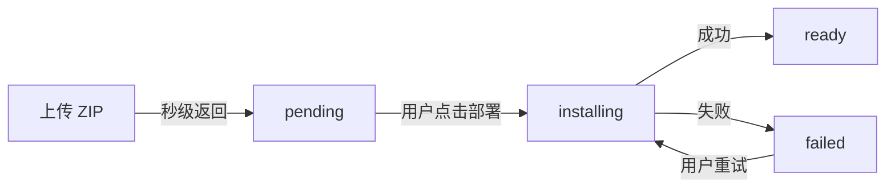

## 概述

本文档描述了 Open SkillHub 的用户级运行时环境设计方案。由于 skill 的 scripts 脚本会在服务端运行，需要为每个用户的私有 skill 空间搭建独立的运行时环境。

### 设计目标

- **隔离性**：每个用户拥有独立的 Python 虚拟环境，避免依赖冲突
- **安全性**：用户间完全隔离，防止恶意代码影响其他用户
- **效率**：依赖预安装，执行时无延迟
- **可维护性**：支持环境清理、依赖冲突处理等运维操作
- **响应速度**：上传秒级返回，安装异步进行

### 核心决策

| 决策项 | 选择 | 理由 |
|--------|------|------|
| 隔离模型 | 用户级别隔离 | 资源占用适中，用户内依赖冲突可控 |
| 安全隔离层级 | subprocess + 环境清理 + 脚本扫描 | 内部可信用户，平衡安全与复杂度 |
| **部署模型** | **上传与部署分离** | **上传秒级返回，用户手动触发部署，体验更好** |
| 环境创建时机 | 首次部署 skill 时 | 按需创建，避免资源浪费 |
| 生命周期 | 长期保留 | 后续执行无需等待环境初始化 |
| 依赖安装时机 | 用户点击「部署运行环境」后安装 | 上传不阻塞，安装与执行解耦 |
| 依赖冲突策略 | 部署阶段前端交互式处理 | 冲突检测推迟到部署时，用户自主决策 |
| Skill 删除时的依赖处理 | 不卸载依赖 | 可能被其他 Skill 使用，避免破坏其他 Skill |
| Skill 版本回滚时的依赖处理 | 不回滚依赖 | 当前环境依赖可能满足需求，避免不必要的卸载/重装。若存在不兼容则提供警告，用户确认后可继续 |
| 依赖升级安全策略 | 影响预检 + 快照恢复 | 升级前执行影响预检（`detect_upgrade_impact`），检查是否影响其他 Skill；安装前自动保存依赖快照，出问题后支持一键恢复 |
| 用户删除所有 Skill 时 | 环境保留 | 等待空闲清理策略处理，用户可能重新上传 |
| 用户删除账户时 | 环境级联删除 | 账户不存在则环境无意义，彻底清理 |
| 环境清理策略 | 组合策略 | 平衡资源占用和运维灵活性 |
| 安装失败处理 | 标记 failed，支持重试 | 上传已完成，安装失败不回滚上传 |
| 并发安全 | 用户级操作锁 | 防止部署过程中执行导致状态不一致 |

### 上传与部署分离

新设计将 Skill 的生命周期拆分为两个独立阶段：

| 状态 | 含义 | 前端标识 | 可执行 |
|------|------|---------|--------|
| `pending` | 已上传，等待部署 | 🔴 红色 | 否 |
| `installing` | 依赖正在安装中 | 🟡 黄色 | 否 |
| `ready` | 运行环境就绪 | 🟢 绿色 | 是 |
| `failed` | 安装失败 | 🔴 红色 | 否 |

**设计特性**：

| 维度 | 说明 |
|------|------|
| 上传耗时 | < 3s（仅验证+解析，不安装依赖） |
| 用户体验 | 秒级响应 |
| 安装失败 | 标记 failed，支持重试 |
| 并发安装 | 互斥但各自独立触发 |
| 状态感知 | 红/黄/绿三色标识 |

---

**导航**： [返回目录](./00-index.md) | [架构设计 →](./02-architecture.md)
