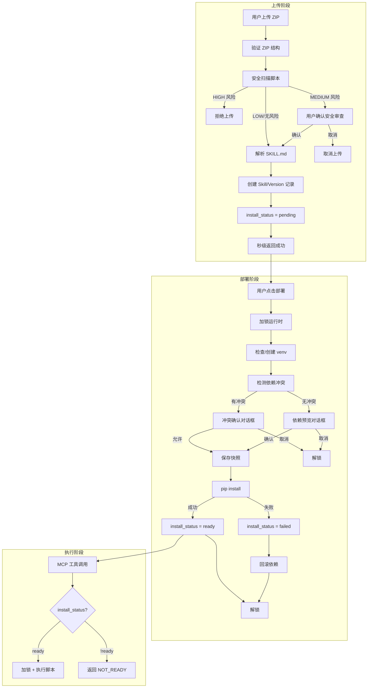

## 核心流程

### 整体流程概览



---

### 1. Skill 上传流程

上传流程**不安装依赖**，仅验证文件、安全扫描、解析元数据，然后秒级返回。

#### 流程步骤

| 步骤 | 操作 | 说明 | 锁状态 |
|------|------|------|--------|
| 1 | 接收 ZIP + 生成 upload_id | 前端上传 Skill ZIP 包，生成临时上传会话 ID | 无锁 |
| 2 | 验证 ZIP 结构 | 检查 SKILL.md 是否存在 | 无锁 |
| 3 | 安全扫描脚本 | 扫描所有 .py/.js/.sh 文件 | 无锁 |
| 3a | HIGH 风险 → 拒绝 | 返回 `SCRIPT_SECURITY_HIGH_RISK`，清理临时文件 | 无锁 |
| 3b | MEDIUM 风险 → 等待确认 | 返回 `security_review` 状态 + `upload_id`（**不创建 Skill 记录**） | 无锁 |
| 4 | 解析 SKILL.md | 提取 name, version, dependencies, script_entry | 无锁 |
| 5 | 创建/更新 Skill 记录 | 新 Skill 创建，已有 Skill 更新（**安全审查确认后执行**） | 无锁 |
| 6 | 创建 SkillVersion 记录 | 存储版本文件和元数据 | 无锁 |
| 7 | 设置 install_status | `install_status = pending` | 无锁 |
| 8 | 返回成功 | 秒级返回，含 skill_uuid 和 pending 状态 | 无锁 |

#### 状态变更

```
无状态 → pending
```

#### API 交互

```json
// POST /api/v1/skills/upload
// Response
{
  "status": "success",
  "skill_uuid": "xxx-xxx-xxx",
  "skill_name": "my-skill",
  "version": "1.0.0",
  "install_status": "pending",
  "dependencies": ["requests>=2.30.0", "numpy>=1.24.0"],
  "message": "Skill uploaded successfully. Please deploy the runtime environment."
}
```

#### 关键设计点

- **全程无锁**：上传不涉及 venv 操作，不需要加锁
- **不安装依赖**：仅解析依赖声明，不执行 pip install
- **安全扫描仍在上传阶段**：高风险脚本尽早拦截
- **install_status=pending**：明确告知用户需要部署才能使用

---

### 2. Skill 部署流程（新增）

用户手动触发部署，执行依赖安装。这是从原上传流程中抽出的"安装依赖"阶段。

#### 流程步骤

| 步骤 | 操作 | 说明 | 锁状态 |
|------|------|------|--------|
| 1 | 用户触发部署 | 点击「部署运行环境」按钮 | 无锁 |
| 2 | 检查 deploy 前置条件 | install_status 为 pending 或 failed | 无锁 |
| 3 | 加锁运行时 | `runtime_locked = True` | 已锁 |
| 4 | 检查/创建 venv | 首次部署时创建虚拟环境 | 已锁 |
| 5 | 解析依赖声明 | 从 SkillVersion.dependencies 读取 | 已锁 |
| 6 | 检测依赖冲突 | 与 `installed_dependencies` 对比 | 已锁 |
| 7a | 有冲突 → 返回冲突信息 | 含受影响 Skill 列表 | 已锁 |
| 7b | 无冲突 → 返回依赖预览 | 待安装和已安装列表 | 已锁 |
| 8 | 用户确认 | 冲突：允许升级 / 无冲突：确认安装 | 已锁 |
| 9 | 保存依赖快照 | `save_dependency_snapshot(is_auto=True)` | 已锁 |
| 10 | 执行 pip install | 逐个安装依赖 | 已锁 |
| 11a | 安装成功 | 更新 `installed_dependencies` | 已锁 |
| 11b | 安装失败 | 回滚已安装的包 | 已锁 |
| 12 | 更新 install_status | 成功 → `ready`，失败 → `failed` | 已锁 |
| 13 | 解锁运行时 | `runtime_locked = False` | 无锁 |

#### 状态变更

```
pending → installing → ready
pending → installing → failed
failed → installing → ready    (重试成功)
failed → installing → failed   (重试失败)
```

#### API 交互

```json
// POST /api/v1/skills/{uuid}/deploy
// Response - 无冲突
{
  "status": "dependency_preview",
  "dependencies": {
    "to_install": [
      {"name": "requests", "version": ">=2.30.0", "reason": "new_dependency"}
    ],
    "already_installed": [
      {"name": "numpy", "version": "1.24.0"}
    ]
  },
  "estimated_duration_seconds": 30
}

// Response - 有冲突
{
  "status": "conflict",
  "conflicts": [...],
  "affected_skills": [...]
}

// POST /api/v1/skills/{uuid}/deploy/confirm
// Response
{
  "status": "installing",
  "message": "Dependency installation started"
}

// GET /api/v1/skills/{uuid}/deploy-status
// Response
{
  "install_status": "ready",
  "installed_dependencies": {"requests": "2.31.0", "numpy": "1.24.0"}
}
```

#### 新版本上传时的部署状态重置

当用户上传新版本时，`install_status` 重置为 `pending`，需要重新部署：

```
用户已有 v1.0.0（ready）→ 上传 v1.1.0 → install_status 重置为 pending → 需要重新部署
```

#### 关键设计点

- **用户主动触发**：部署是独立操作，不自动触发
- **可重试**：failed 状态可以直接重新部署
- **冲突在部署时检测**：上传时不检测冲突（因为还没装），部署时检测
- **锁保护部署过程**：部署期间不能执行，执行期间不能部署
- **回滚仅回滚依赖**：安装失败回滚已安装的包，Skill 记录保留

---

### 3. Skill 执行流程

执行前新增 `install_status` 检查，确保运行环境已就绪。

#### 流程步骤

| 步骤 | 操作 | 说明 | 锁状态 |
|------|------|------|--------|
| 1 | MCP 工具调用 | Agent 触发 `load_skill` 或 `execute_skill` | 无锁 |
| 2 | 检查 install_status | 必须为 `ready` | 无锁 |
| 2a | 非 ready → 返回错误 | `RUNTIME_NOT_READY` | 无锁 |
| 3 | 检查运行时锁 | `runtime_locked` 是否为 True | 无锁 |
| 3a | 已锁 → 返回错误 | `RUNTIME_LOCKED` | 无锁 |
| 4 | 加锁运行时 | `runtime_locked = True` | 已锁 |
| 5 | 构建 safe environment | 清理环境变量，设置 PATH | 已锁 |
| 6 | 执行脚本 | subprocess 使用用户 venv 的 python | 已锁 |
| 7 | 捕获输出 | stdout/stderr + 超时控制 | 已锁 |
| 8 | 解锁运行时 | `runtime_locked = False` | 无锁 |
| 9 | 返回结果 | 脚本输出 + 执行状态 | 无锁 |

#### 前置检查逻辑

执行前检查包含两部分：部署状态检查和运行时锁检查。

- **部署状态检查**：`install_status` 必须为 `ready`，否则返回 `RUNTIME_NOT_READY`
- **运行时锁检查**：`runtime_locked` 为 `True` 时返回 `RUNTIME_LOCKED`，并计算 `retry_after` 和 `suggest_admin`

> **完整实现**参见 [并发安全机制 - 执行前检查逻辑](./05-concurrency.md#执行前检查逻辑)。

#### 关键设计点

- **install_status 优先检查**：先检查部署状态，再检查锁状态，返回更精确的错误信息
- **执行不改变 install_status**：执行不影响部署状态，只有部署操作改变状态

---

### 4. Skill 删除流程

删除 Skill 不影响其他 Skill 的运行环境。

| 步骤 | 操作 | 说明 |
|------|------|------|
| 1 | 检查运行时锁 | 锁定时禁止删除 |
| 2 | 删除 Skill 文件 | 物理删除 `{SKILL_STORAGE_PATH}/{user_id}/{skill_name}` |
| 3 | 删除版本记录 | 删除 SkillVersion 记录 |
| 4 | 删除 Skill 记录 | 删除 Skill 记录 |
| 5 | 不卸载依赖 | 其他 Skill 可能使用相同依赖 |

> **注意**：如果删除的是当前唯一一个 `install_status=ready` 的 Skill，venv 不会立即清理，等待空闲清理策略处理。

---

### 5. 用户删除账户流程

级联清理所有资源。

| 步骤 | 操作 | 说明 |
|------|------|------|
| 1 | 删除所有 Skill 文件 | 物理删除用户 Skill 根目录 |
| 2 | 删除所有 Skill 和 Version 记录 | 数据库清理 |
| 3 | 删除虚拟环境 | 物理删除 venv 目录 |
| 4 | 删除依赖快照 | 数据库级联删除（外键 CASCADE） |
| 5 | 删除用户记录 | 最后执行，确保能获取路径信息 |

---

### 6. 用户删除所有 Skill 时的处理

| 步骤 | 操作 | 说明 |
|------|------|------|
| 1 | 删除所有 Skill | 逐个执行删除流程 |
| 2 | 保留 venv | `venv_last_used_at` 保持不变 |
| 3 | 等待空闲清理 | 空闲超时 + 无 Skill → 自动清理 |

---

### 7. Skill 版本回滚流程

版本回滚不回滚依赖。

| 步骤 | 操作 | 说明 |
|------|------|------|
| 1 | 检查运行时锁 | 锁定时禁止回滚 |
| 2 | 检查目标版本是否存在 | |
| 3 | 获取目标版本的依赖声明 | |
| 4 | 检查依赖兼容性 | 与已安装依赖对比 |
| 5a | 兼容 → 直接切换版本 | 更新 `current_version` |
| 5b | 不兼容 → 返回警告 | 用户确认后切换 |
| 6 | 更新 `venv_last_used_at` | |

> **注意**：版本回滚**不重置** `install_status`。如果当前是 `ready`，回滚后仍为 `ready`，但可能存在依赖不匹配的风险（步骤 4 已检测并警告）。


---

**导航**： [← 数据模型](./03-data-model.md) | [返回目录](./00-index.md) | [并发安全机制 →](./05-concurrency.md)
