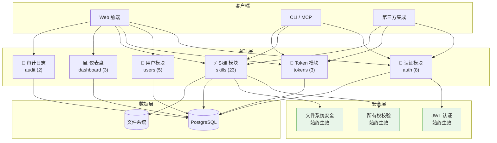
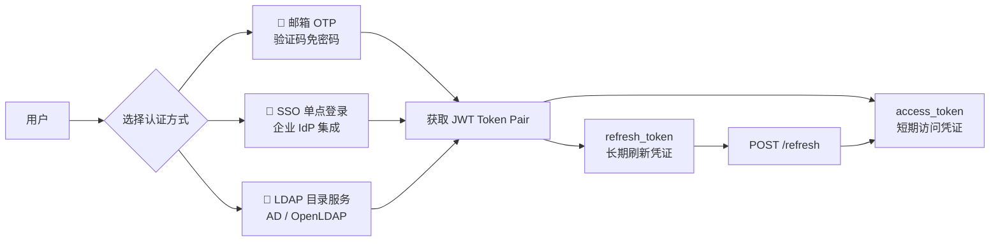
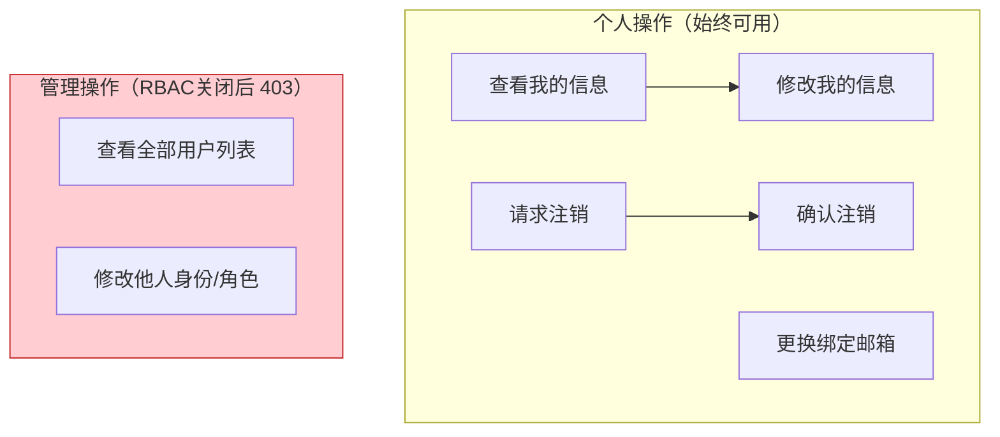
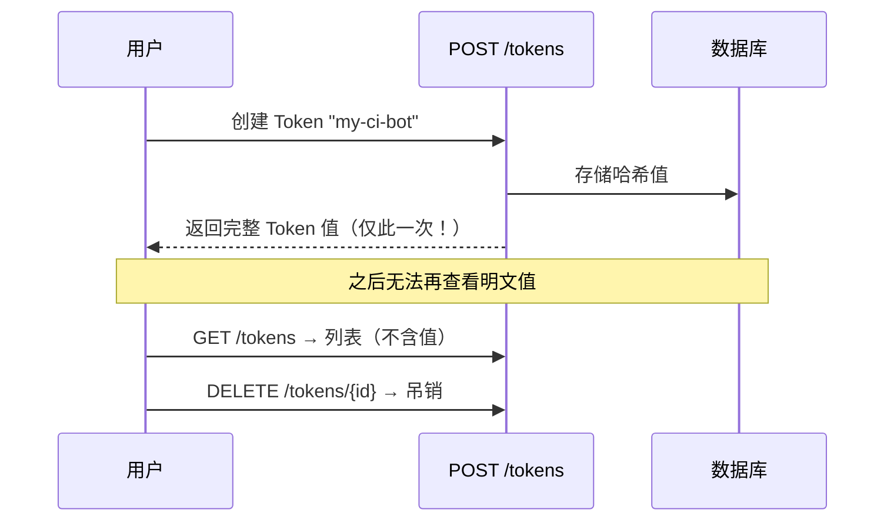
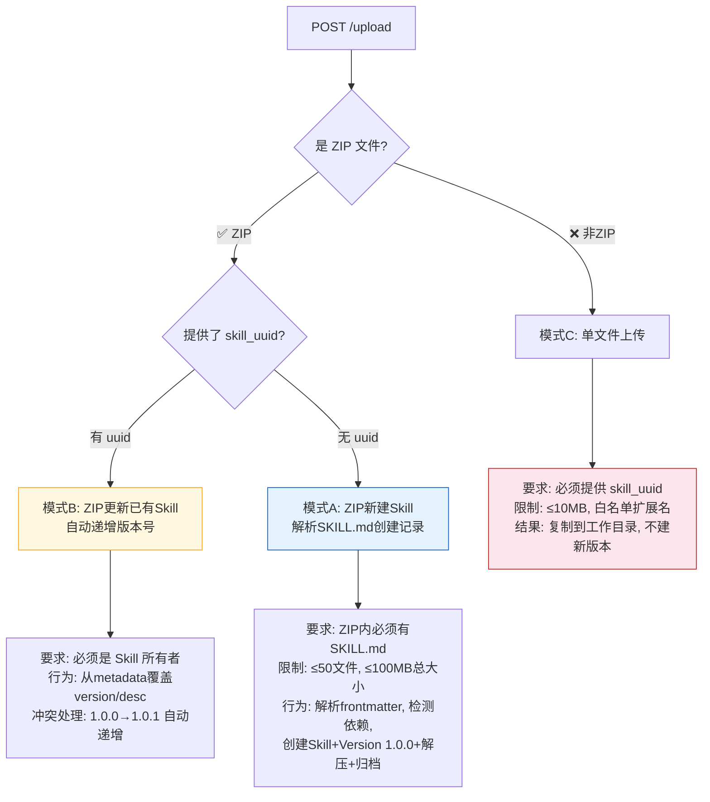
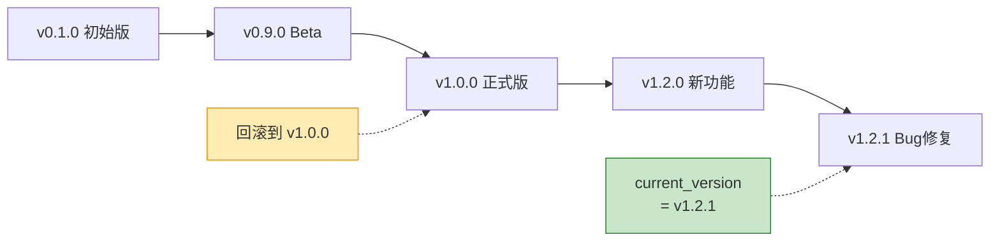
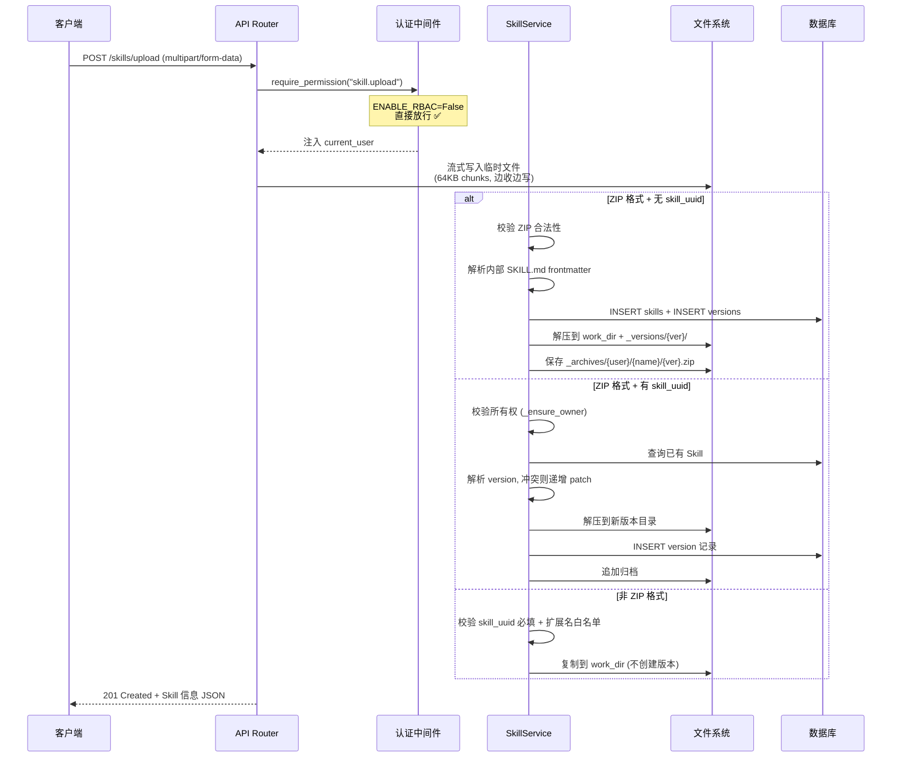
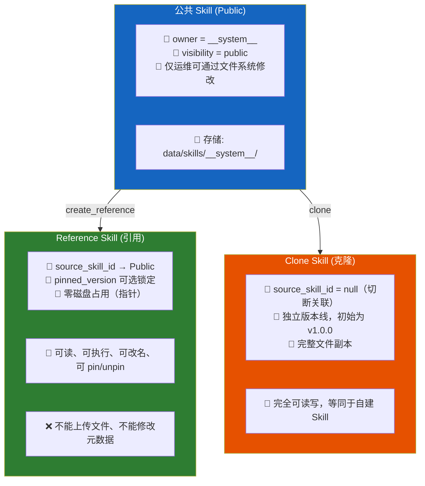
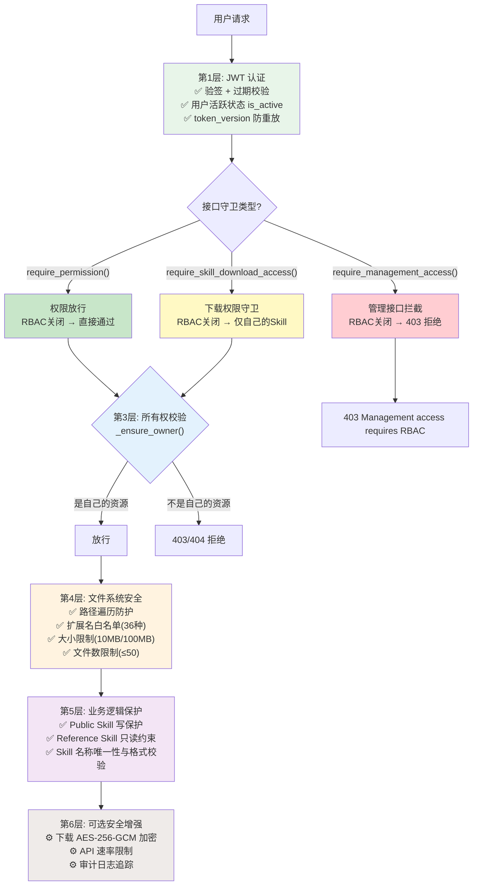

# 不开启 RBAC 时系统功能清单

> 基于 `ENABLE_RBAC=False`（默认配置）下的完整功能盘点。使用 `require_permission()` 守卫的接口对**所有已认证用户**开放；使用 `require_management_access()` 守卫的接口在 RBAC 关闭时返回 403 不可用；下载接口仅允许操作自己拥有的 Skill。

---

## 目录

- [系统架构一览](#系统架构一览)
- [功能全景](#功能全景)
  - [认证登录](#1-认证登录-8个接口)
  - [账号与用户](#2-账号与用户-7个接口)
  - [API Token](#3-api-token-3个接口)
  - [Skill 技能包 — 核心](#4-skill-技能包--核心-23个接口)
  - [仪表盘](#5-仪表盘-3个接口-rbac关闭后1个可用)
  - [审计日志](#6-审计日志-2个接口-rbac关闭后不可用)
- [上传机制详解](#上传机制详解)
- [公共 Skill 生态](#公共-skill-生态)
- [RBAC 关闭带来的权限变化](#rbac-关闭带来的权限变化)
- [安全防护体系](#安全防护体系)
- [配置开关速查](#配置开关速查)

补充阅读：

- [无 RBAC 模式下的权限模型说明](./permission-model-without-rbac.md)
- [无 RBAC 模式用户操作手册](./user-guide-without-rbac.md)
- [无 RBAC 模式下的前端页面说明](./frontend-pages-without-rbac.md)
- [无 RBAC 模式常见问题](./faq-without-rbac.md)

---

## 系统架构一览



**关键认知**：RBAC 关闭后，角色概念（admin/member/viewer）对 `require_permission()` 守卫的接口完全消失——系统的安全模型退化为两层——**"你是谁"**（JWT 身份）+ **"这是不是你的东西"**（所有权检查）。但对于 `require_management_access()` 守卫的管理接口，RBAC 关闭意味着直接拒绝访问；对于下载接口，则退化为仅允许下载自己的 Skill。

---

## 功能全景

### 1. 认证登录（8 个接口）

系统支持四种独立的认证方式，各自通过配置开关控制，可以同时启用多套。



| 接口 | 方法 | 作用 | 前置条件 |
|------|------|------|----------|
| `/api/v1/auth/verification-code` | POST | 发送邮箱 OTP 验证码 | `ENABLE_EMAIL_OTP_LOGIN=True` |
| `/api/v1/auth/register` | POST | 验证码注册新账号 | `ENABLE_PUBLIC_SIGNUP=True` |
| `/api/v1/auth/login` | POST | 验证码登录（自动创建用户） | `ENABLE_EMAIL_OTP_LOGIN=True` |
| `/api/v1/auth/refresh` | POST | 用 refresh_token 换新 access_token | 始终可用 |
| `/api/v1/auth/logout` | POST | 使全部 JWT 失效（递增版本号） | 需要登录 |
| `/api/v1/auth/sso/prepare` | POST | 获取 SSO nonce 防重放 | `ENABLE_SSO=True` |
| `/api/v1/auth/sso/login` | POST | id_token + nonce 完成认证 | `ENABLE_SSO=True` |

此外还有一个 LDAP 登录入口 `POST /api/v1/auth/ldap/login`（需 `ENABLE_LDAP=True`），使用用户名 + 密码完成认证。此接口已计入上方总数。

> **关于自动创建用户**：邮箱 OTP 登录时，如果该邮箱尚未注册，系统会自动创建一个随机用户名的账号并直接返回 Token——这是有意设计的"零摩擦"登录体验。

---

### 2. 账号与用户（7 个接口，RBAC 关闭后 5 个可用）

分为**个人操作**和**管理操作**两部分。RBAC 关闭后，管理接口使用 `require_management_access()` 守卫，**直接返回 403 不可用**。



| 接口 | 方法 | 类别 | 说明 |
|------|------|------|------|
| `/api/v1/users/me` | GET | 个人 | 返回当前登录用户的完整信息 |
| `/api/v1/users/me` | PUT | 个人 | 更新用户名、头像等字段 |
| `/api/v1/users/bind-email` | POST | 个人 | 通过验证码更换绑定邮箱 |
| `/api/v1/users/me/delete-request` | POST | 个人 | 发送注销确认验证码到邮箱 |
| `/api/v1/users/me` | DELETE | 个人 | 验证码确认后永久删除账号 |
| `/api/v1/users` | GET | 管理 | 分页查询系统中所有用户 🚫 |
| `/api/v1/users/{id}/identity` | PUT | 管理 | 修改任意用户的角色或状态 🚫 |

🚫 标记的接口使用 `require_management_access()` 守卫，RBAC 关闭时返回 403 "Management access requires RBAC"，**完全不可用**。RBAC 开启时仅 admin 可调用。

---

### 3. API Token（3 个接口）

API Token 是一种长期有效的持久化凭据，用于服务间调用或自动化场景，区别于短期的 JWT access_token。



| 接口 | 方法 | 说明 |
|------|------|------|
| `/api/v1/tokens` | GET | 查看自己创建的所有 Token（名称、状态、过期时间，但**不含值**） |
| `/api/v1/tokens` | POST | 创建新 Token，返回完整字符串（**仅创建时可见一次**） |
| `/api/v1/tokens/{id}` | DELETE | 吊销指定 Token |

典型用途：CI/CD 流水线、MCP Server 配置、CLI 工具认证、第三方 Webhook 回调。

---

### 4. Skill 技能包 — 核心（23 个接口）

这是系统最核心的模块。一个 Skill 就是一个可执行的技能包，包含代码、依赖声明和描述文件（SKILL.md），类似于 npm 包或 Docker 镜像的概念。

#### 4.1 浏览与发现（5 个接口）

| 接口 | 方法 | 说明 |
|------|------|------|
| `/api/v1/skills` | GET | 列出自己的 Skills，支持关键词搜索，可选包含已停用的 |
| `/api/v1/skills/public` | GET | 浏览系统预置的公共 Skills（无需强制登录） |
| `/api/v1/skills/public/{uuid}` | GET | 公共 Skill 的详细信息 |
| `/api/v1/skills/{uuid}` | GET | 某 Skill 的完整信息（含类型标签和解析版本） |
| `/api/v1/skills/cache-policy` | GET | 缓存 TTL、加密状态等运行配置 |

每个 Skill 对象都会携带三个增强字段，帮助前端判断类型和行为：

- `skill_kind`：值为 `regular`（普通）/ `reference`（引用）/ `clone`（克隆）/ `public`（公共）
- `resolved_version`：Reference 类型会指向源 Skill 的实际版本号
- `is_reference_read_only`：是否处于只读引用状态

#### 4.2 创建与上传（2 个入口，3 种模式）

**入口一**：`POST /api/v1/skills` —— 仅创建一条空的元数据记录，不含任何文件。

**入口二**：`POST /api/v1/skills/upload` —— 这是主上传接口，根据参数不同走三条路径：



三种模式的适用场景：

| 模式 | 典型场景 | 举例 |
|------|----------|------|
| A — ZIP 新建 | 第一次发布一个全新 Skill | 把写好的 Python 数据分析脚本打包成 ZIP 上传 |
| B — ZIP 更新 | 给已有 Skill 发布新版本 | 修复 bug 后打包新版 ZIP，带上原 skill_uuid 上传 |
| C — 单文件追加 | 只改一个文件，不想重新打包 | 往已有 Skill 里补一个 `utils.py` 工具函数文件 |

#### 4.3 编辑与管理（4 个接口）

| 接口 | 方法 | 说明 |
|------|------|------|
| `/api/v1/skills/{uuid}` | PUT | 修改名称、描述、标签、可见性等元数据 |
| `/api/v1/skills/{uuid}` | DELETE | 彻底删除（含文件和归档）；加 `?delete_archives=true` 同步清理归档 |
| `/api/v1/skills/{uuid}/deactivate` | POST | 软停用（返回 410 Gone），数据保留可恢复 |
| `/api/v1/skills/{uuid}/activate` | POST | 重新激活已停用的 Skill |

删除 vs 停用的区别：停用是可逆的软删除（标记 `is_active=false`），删除是不可逆的物理移除。

#### 4.4 版本管理（5 个接口）

每个 Skill 可以拥有多个版本，类似 Git 的提交历史。当前活跃版本由 `current_version` 字段指向。



| 接口 | 方法 | 说明 |
|------|------|------|
| `/api/v1/skills/{uuid}/versions` | GET | 全部版本的按时间排列列表 |
| `/api/v1/skills/{uuid}/versions/{ver}` | GET | 特定版本的详细元数据和依赖信息 |
| `/api/v1/skills/{uuid}/versions/diff` | GET | 指定两个版本的文件差异比对（`?from=&to=`） |
| `/api/v1/skills/{uuid}/versions/{ver}/install-instructions` | GET | 该版本依赖的安装命令（pip/npm 等） |
| `/api/v1/skills/{uuid}/versions/{ver}/rollback` | POST | 将 current_version 指针回滚到指定版本 |

回滚不会删除任何数据，只是移动指针。回滚到 v1.0.0 后再发新版就是 v1.0.1（从 v1.0.0 的视角递增）。

#### 4.5 文件浏览（2 个接口）

| 接口 | 方法 | 说明 |
|------|------|------|
| `/api/v1/skills/{uuid}/files` | GET | 当前版本的完整目录树（递归列出所有文件路径和大小） |
| `/api/v1/skills/{uuid}/files/{path}` | GET | 读取指定文件的文本内容（`path` 支持多层嵌套如 `src/utils/helper.py`） |

文件读取接口内置了**路径遍历防护**，会拦截含 `../` 的恶意路径请求。

#### 4.6 下载（1 个接口）

`POST /api/v1/skills/download` 是唯一的下载入口。

请求体：
```json
{
  "skill_uuid": "目标的 UUID",
  "version": "1.0.0"
}
```
`version` 可选——省略则下载 `current_version` 指向的版本。

响应中 `encrypted_code` 字段包含整体归档的 base64 内容（未加密时为 ZIP 的 base64，加密时为 AES-256-GCM 加密后的 base64 密文）。如果开启了下载加密（`ENABLE_SKILL_DOWNLOAD_ENCRYPTION=true`），则整个归档包使用 AES-256-GCM 加密。

前端拿到响应后会将其序列化为 JSON 并触发浏览器原生下载，文件名格式为 `skill-{前8位UUID}-{版本号}.json`（加密时后缀为 `.encrypted.json`）。

> RBAC 开启时，下载仅 admin 可用；RBAC 关闭后，下载受 `require_skill_download_access()` 守卫——**只能下载自己拥有的 Skill**（`skill.user_id == current_user.id`），非自己拥有的 Skill 返回 403。

#### 4.7 公共 Skill 衍生（4 个接口）

详见下方「公共 Skill 生态」专节。

---

### 5. 仪表盘（3 个接口，RBAC 关闭后 1 个可用）

面向个人的轻量统计面板，展示当前用户的 Skill 和 Token 使用情况以及近期 API 调用的成功率。

| 接口 | 方法 | 说明 |
|------|------|------|
| `/api/v1/dashboard/overview` | GET | 返回：活跃 Skill 数、可用 Token 数、24h 内 API 成功率 |
| `/api/v1/dashboard/metrics/cleanup` | POST | 清理超过保留天数的请求数据 🚫 |
| `/api/v1/dashboard/metrics/reset-24h` | POST | 清空最近 24 小时的统计数据 🚫 |

概览响应示例：

🚫 标记的接口使用 `require_management_access()` 守卫，RBAC 关闭时返回 403 不可用。概览接口使用 `require_permission(Permission.DASHBOARD_READ)`，RBAC 关闭后正常可用。

```json
{
  "active_skills": 12,
  "available_tokens": 3,
  "success_rate": 97.3,
  "success_rate_window_hours": 24,
  "success_rate_total": 450
}
```

---

### 6. 审计日志（2 个接口，RBAC 关闭后不可用）

系统会在关键操作发生时自动写入审计事件（前提是 `ENABLE_AUDIT_LOG=True`），覆盖范围包括：注册/登录/登出、Skill 的创建/更新/删除/上传/下载/停用/回滚/引用/克隆、Token 的创建和吊销、用户注销等。

| 接口 | 方法 | 说明 | 前置条件 |
|------|------|------|----------|
| `/api/v1/audit/logs` | GET | 按操作者、操作类型、时间范围筛选分页查询 | `ENABLE_AUDIT_LOG=True` 🚫 |
| `/api/v1/audit/logs/export` | POST | 将符合条件的日志导出为 JSON 或 CSV 文件 | `ENABLE_AUDIT_LOG=True` + `ENABLE_AUDIT_EXPORT=True` 🚫 |

导出接口单次最多拉取 1000 条记录。

🚫 标记的接口使用 `require_management_access()` 守卫，RBAC 关闭时返回 403 不可用。

---

## 上传机制详解

上传是 Skill 模块最复杂的操作，值得单独梳理其端到端流程。



**存储目录结构**（以用户 `user-abc` 的 Skill `my-analyzer` v1.2.0 为例）：

```
data/
├── skills/
│   └── user-abc/
│       └── my-analyzer/              ← 当前工作目录（最新版本展开）
│           ├── SKILL.md
│           ├── main.py
│           ├── requirements.txt
│           └── _versions/
│               └── 1.2.0/            ← 版本快照（每次上传/更新留存）
│                   ├── SKILL.md
│                   ├── main.py
│                   └── requirements.txt
└── _archives/
    └── user-abc/
        └── my-analyzer/
            └── 1.2.0.zip            ← 原始上传包备份（用于下载时打包）
```

**硬编码的安全限制**：

| 限制项 | 值 | 触发后果 |
|--------|-----|----------|
| 单文件大小 | 10 MB | 返回 413 FILE_TOO_LARGE |
| Skill 总大小 | 100 MB | 返回 400 TOTAL_SKILL_SIZE_LIMIT_EXCEEDED |
| 文件数量上限 | 50 个 | 返回 400 TOO_MANY_FILES |
| 文件扩展名 | 36 种白名单 | 返回 400 INVALID_FILENAME |

---

## 公共 Skill 生态

当 `ENABLE_SKILL_VISIBILITY=True` 且 `ENABLE_RBAC=False` 同时满足时，系统解锁一套三层技能分发机制。这是解决"新用户如何获得可用技能"问题的方案。



### 三者的直观类比

| 类型 | 类比 | 存储开销 | 可编辑 | 版本策略 | 适用阶段 |
|------|------|----------|--------|----------|----------|
| **Public** | npm 官方包 / 系统预装软件 | 1 份 | ❌ 普通用户不可 | 自身迭代 | 基础设施层 |
| **Reference** | `npm link` / 符号链接 | ≈ 0（仅数据库记录） | 半只读（改名+pin） | 可锁定或跟随源 | 快速试用 |
| **Clone** | `git clone` / 另存为 | 1 份完整副本 | ✅ 完全自由 | 独立演进 | 深度定制 |

### 四个衍生接口

| 操作 | 接口 | 说明 |
|------|------|------|
| 创建引用 | `POST /api/v1/skills/{pub_uuid}/reference` | 传入 name 和可选 pinned_version |
| 克隆副本 | `POST /api/v1/skills/{pub_uuid}/clone` | 传入 name 和 visibility，得到完全独立的 Skill |
| 锁定版本 | `PUT /api/v1/skills/{ref_uuid}/pin` | 固定 Reference 到某个具体版本，不受源更新的影响 |
| 取消锁定 | `PUT /api/v1/skills/{ref_uuid}/unpin` | 恢复跟随源 Skill 最新版本 |

### Reference 的版本解析优先级

当对 Reference 执行任何操作（读文件、下载、执行等）时，系统按以下顺序决定使用哪个版本的文件：

```
pinned_version（用户主动锁定的版本）
    ↓ 为空时 fallback 到
requested_version（本次请求手动指定的 version 参数）
    ↓ 为空时 fallback 到
source_skill.current_version（源公共 Skill 的最新版本）
```

这意味着 pin 了 `"2.0.0"` 的 Reference，即使源已经迭代到了 `"3.0.0"`，它始终使用 `2.0.0` 的文件。只有显式取消 pin 或临时指定 `version="3.0.0"` 才能切换。

---

## RBAC 关闭带来的权限变化

代码中存在两类权限守卫，它们在 RBAC 关闭时的行为截然不同：

- **`require_permission()`** —— RBAC 关闭时 `has_permission()` 短路返回 True，等价于全部放行
- **`require_management_access()`** —— RBAC 关闭时直接返回 403，**管理接口不可用**
- **`require_skill_download_access()`** —— RBAC 关闭时仅允许下载自己拥有的 Skill

### 有实质变化的功能点

| # | 功能 | 守卫类型 | RBAC 开启时 | RBAC 关闭后 | 说明 |
|---|------|----------|------------|------------|------|
| 1 | **Skill 下载** | `require_skill_download_access` | 仅 admin | 仅自己的 Skill | 从管理员特权变为自服务下载，不能下载他人的 Skill |
| 2 | **用户列表** | `require_management_access` | 仅 admin | 403 不可用 | 管理接口在 RBAC 关闭时彻底禁用 |
| 3 | **修改他人身份** | `require_management_access` | 仅 admin | 403 不可用 | 管理接口在 RBAC 关闭时彻底禁用 |
| 4 | **查看审计日志** | `require_management_access` | 仅 admin | 403 不可用 | 管理接口在 RBAC 关闭时彻底禁用 |
| 5 | **导出审计日志** | `require_management_access` | 仅 admin | 403 不可用 | 管理接口在 RBAC 关闭时彻底禁用 |
| 6 | **清理/重置指标** | `require_management_access` | 仅 admin | 403 不可用 | 管理接口在 RBAC 关闭时彻底禁用 |

**关键设计意图**：`require_management_access()` 采取了"宁可不服务也不乱服务"的策略——既然 RBAC 关闭意味着没有角色体系来支撑管理权限的判定，那就直接拒绝这些管理操作，避免出现"任何人都能提权为管理员"的安全漏洞。

### 无变化的功能（使用 `require_permission()`，RBAC 关闭后全部放行）

Skill 的列表、读取、创建、更新、删除、上传——这些操作在 RBAC 开启时就对 member 角色开放，而默认角色就是 member，所以关闭 RBAC 后没有任何感知差异。

---

## 安全防护体系

即使没有 RBAC，系统仍然依靠多层防御保障安全。



各层的关键保护点总结如下。

**第 1 层 —— 身份认证**：所有需要认证的接口都经过 JWT 验签。Token 泄露后的风险可以通过登出操作（递增 token_version 使旧 Token 全部失效）来紧急止损。

**第 2 层 —— 接口守卫分流**：代码中有三种权限守卫，在 RBAC 关闭时行为不同：
- `require_permission()` —— RBAC 关闭后短路放行，等同于只检查 JWT 是否有效
- `require_management_access()` —— RBAC 关闭后直接返回 403，管理接口完全不可用
- `require_skill_download_access()` —— RBAC 关闭后只允许下载自己拥有的 Skill（`skill.user_id == current_user.id`）

**第 3 层 —— 所有权隔离**：即使通过了认证和守卫，用户也只能操作属于自己的资源。Skill 的上传、更新、删除、停用都会调用 `_ensure_owner()` 检查 `skill.user_id == current_user.id`。Token 和仪表盘数据同样按 user_id 过滤。

**第 4 层 —— 文件系统安全**：防止通过恶意文件路径进行目录穿越攻击（拦截 `../`）、限制可上传的文件类型、控制单个 Skill 的总体积和文件数量，避免滥用存储资源。

**第 5 层 —— 业务逻辑守卫**：公共 Skill（visibility=public）拒绝普通用户的写操作；Reference Skill 拦截所有文件上传和元数据修改请求，返回 409 CONFLICT + `REFERENCE_SKILL_READ_ONLY` 错误码。

**第 6 层 —— 可选加固**：下载加密、速率限制和审计日志都是可选功能，通过各自的 `ENABLE_*` 开关控制。

---

## 配置开关速查

以下是影响功能可用性的全部配置项，按类别分组。

```env
# ═══════════════ 权限与角色 ═══════════════
ENABLE_RBAC=False                      # 本文档的前提条件，默认关闭
DEFAULT_ROLE=member                    # RBAC 关闭时不生效

# ═══════════════ 注册与登录 ═══════════════
ENABLE_PUBLIC_SIGNUP=False             # 是否开放自助注册
ENABLE_EMAIL_OTP_LOGIN=False           # 邮箱验证码登录（注册+登录共用）
ENABLE_SSO=False                       # 企业 SSO 单点登录
ENABLE_LDAP=False                      # LDAP/AD 目录服务认证

# ═══════════════ 公共 Skill 生态 ═══════════════
ENABLE_SKILL_VISIBILITY=False          # 必须=True 才能使用 Public/Reference/Clone

# ═══════════════ 安全选项 ═══════════════
ENABLE_SKILL_DOWNLOAD_ENCRYPTION=False # 下载时对文件做 AES-256-GCM 加密
ENABLE_LOCAL_CACHE_ENCRYPTION=False    # 本地缓存加密
ENABLE_RATE_LIMIT=False                # 全局 API 速率限制
SKILL_DOWNLOAD_RATE_LIMIT_REQUESTS=60  # 下载限流：窗口内最大请求数
SKILL_DOWNLOAD_RATE_LIMIT_WINDOW=60    # 下载限流：窗口宽度（秒）

# ═══════════════ 审计日志 ═══════════════
ENABLE_AUDIT_LOG=False                # 记录操作审计事件
ENABLE_AUDIT_EXPORT=False             # 允许导出审计数据

# ═══════════════ 存储硬限制（不可配置，写死在代码中）═══════════════
# MAX_FILE_SIZE      = 10 MB   （单文件上限）
# MAX_TOTAL_SIZE     = 100 MB   （单个 Skill 总大小上限）
# MAX_FILES          = 50      （单个 Skill 最大文件数）
```

**常用组合推荐**：

| 场景 | 推荐配置 | 理由 |
|------|----------|------|
| 个人开发机 | 保持默认全部 False | 最简配置，仅自己使用；管理接口因 RBAC 关闭而不可用，但个人使用不需要管理功能 |
| 小团队内网 | 开启 EMAIL_OTP + AUDIT_LOG | 多人协作需要登录和操作追溯；管理接口不可用意味着无人能查看他人信息或修改角色——如需这些功能必须开启 RBAC |
| 对外演示环境 | 开启 PUBLIC_SIGNUP + EMAIL_OTP + VISIBILITY | 让访客能注册并看到预置的公共 Skill；管理接口不可用反而保护了演示环境不被误操作 |
| 生产部署（建议开 RBAC） | `ENABLE_RBAC=True` + 合理分配角色 | 多用户环境下必须开启 RBAC 才能使用用户管理、审计日志、全局下载等管理功能 |

---

## 总结数字

| 维度 | 数值 |
|------|------|
| 总 API 接口数 | **46 个**（RBAC 关闭后 6 个管理接口返回 403，实际可用 40 个） |
| 功能模块数 | **6 大模块** |
| 认证方式 | **4 种**（OTP / SSO / LDAP / 待扩展） |
| Skill 类型 | **4 种**（Regular / Public / Reference / Clone） |
| 上传模式 | **3 种**（ZIP新建 / ZIP更新 / 单文件） |
| 安全防护层数 | **6 层**（JWT / 接口守卫分流 / 所有权 / 文件系统 / 业务逻辑 / 可选加固） |
| RBAC 关闭后不可用的管理接口 | **6 个**（用户列表、修改身份、审计查看/导出、指标清理/重置） |
| RBAC 关闭后受限的接口 | **1 个**（下载仅限自己的 Skill） |
| 总独立 API 接口数 | **46 个**（去重尾部斜杠双注册后） |
