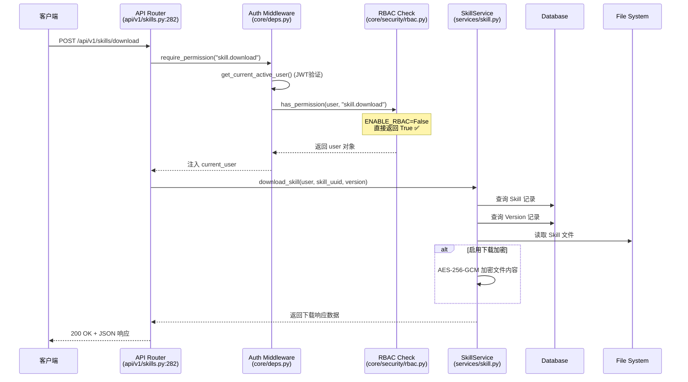
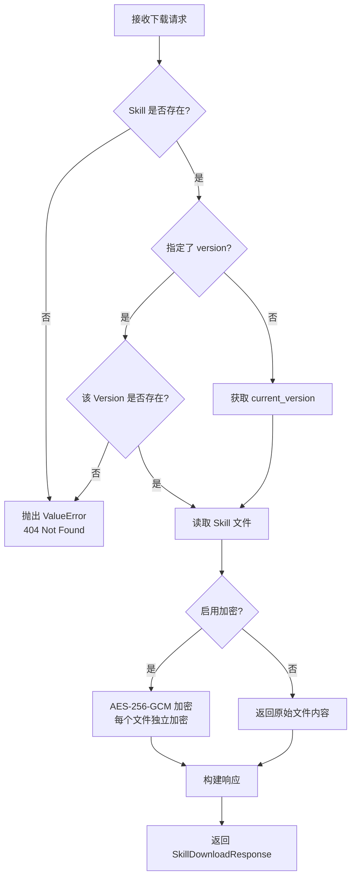

# 不开启 RBAC 情况下用户下载 Skill 的完整流程

基于代码分析，以下是完整的下载流程：

## 一、整体架构流程图



---

## 二、关键代码路径详解

### 1. 入口：API 路由层

**文件**: `backend/api/v1/skills.py:282-303`

```python
@router.post("/download", response_model=SkillDownloadResponse)
async def download_skill(
    request: Request,
    payload: SkillDownloadRequest,
    current_user=Depends(require_permission("skill.download")),  # ← 权限检查点
    session=Depends(get_async_session),
):
    service = SkillService(SkillRepository(session), SkillVersionRepository(session))
    try:
        result = await service.download_skill(current_user, payload.skill_uuid, payload.version)
    except ValueError as exc:
        raise HTTPException(status_code=status.HTTP_404_NOT_FOUND, detail=str(exc)) from exc
    response_payload = SkillDownloadResponse.model_validate(result)
    if settings.ENABLE_AUDIT_LOG:
        audit_service = AuditService(AuditLogRepository(session))
        await audit_service.create_event(
            actor_id=current_user.id,
            action="skill.download",
            target=payload.skill_uuid,
            ip=request.client.host if request and request.client else "",
            user_agent=request.headers.get("user-agent", ""),
        )
    return response_payload
```

**请求参数** (`SkillDownloadRequest`):

| 参数 | 类型 | 必填 | 说明 |
|------|------|------|------|
| `skill_uuid` | string (UUID) | ✅ | 要下载的 Skill UUID |
| `version` | string | ❌ | 指定版本号（不传则下载当前版本） |

**响应结构** (`SkillDownloadResponse`):

```typescript
{
  skill_uuid: string,
  name: string,
  version: string,
  files: Array<{
    path: string,
    content: string,      // Base64 编码或明文（取决于加密配置）
    size: number
  }>,
  metadata: object,
  download_encryption_enabled: boolean
}
```

---

### 2. RBAC 权限检查（核心！）

**文件**: `backend/core/security/rbac.py:43-50`

```python
def has_permission(user: User, permission: str) -> bool:
    if not settings.ENABLE_RBAC:   # ← 默认为 False！
        return True                 # ← 直接放行，不检查任何权限！
    if user.is_superuser:
        return True
    role = (user.role or settings.DEFAULT_ROLE or "member").strip()
    permissions = get_role_permissions().get(role, set())
    return "*" in permissions or permission in permissions
```

**关键配置项** (`backend/config/settings.py`):
```python
ENABLE_RBAC: bool = False  # ← 默认关闭！
```

**权限常量定义** (`backend/core/permissions.py:108`):

```python
class Permission:
    # ...
    SKILL_DOWNLOAD: str = "skill.download"
```

**角色权限矩阵** (`backend/core/security/rbac.py:8-21`)：

| Permission | Admin | Member | Viewer |
|------------|-------|--------|--------|
| skill.list | ✅ | ✅ | ✅ |
| skill.read | ✅ | ✅ | ✅ |
| skill.create | ✅ | ✅ | ❌ |
| skill.update | ✅ | ✅ | ❌ |
| skill.delete | ✅ | ✅ | ❌ |
| skill.upload | ✅ | ✅ | ❌ |
| skill.execute | ✅ | ✅ | ❌ |
| **skill.download** | **✅** | **❌** | **❌** |

> 注：RBAC 关闭时，上述矩阵完全失效，所有权限检查均返回 `True`。

**结论**：当 RBAC 关闭时：
- 所有 `require_permission()` 检查都会直接通过
- 不校验用户角色（admin/member/viewer）
- 不校验用户是否为 `is_superuser`
- 只需要**有效的 JWT 认证**即可调用下载接口

---

### 3. JWT 认证流程（仍然生效）

即使 RBAC 关闭，JWT 认证**必须通过**：

**文件链路**：
```
core/deps.py → core/middleware/auth.py
```

```python
# require_permission 依赖注入 (core/deps.py:26-74)
def require_permission(permission: str):
    async def _permission_checker(current_user=Depends(get_current_active_user)):
        if not has_permission(current_user, permission):
            raise HTTPException(status_code=403, detail="Permission denied")
        return current_user
    return _permission_checker
```

**认证步骤**：
1. 从 `Authorization: Bearer <token>` 头提取 JWT Token
2. 验 Token 签名和过期时间（`decode_token`）
3. 从数据库加载用户记录（`repo.get_by_id(user_id)`）
4. 检查用户状态 `user.is_active`
5. 通过后返回 user 对象

---

### 4. 业务逻辑：SkillService.download_skill()

**文件位置**: `backend/services/skill.py`

**执行流程**：



**关键逻辑点**：

1. **Skill 存在性校验**
2. **Version 解析**：未指定 version 时使用 `current_version`
3. **文件系统读取**：从 `{SKILL_STORAGE_PATH}/{user_id}/{skill_name}/` 读取
4. **可选加密**：根据 `ENABLE_SKILL_DOWNLOAD_ENCRYPTION` 配置决定是否加密

---

## 三、前端下载入口实现

### 1. UI 组件位置

**文件**: `frontend/src/app/skills/[skillUuid]/_components/versions-tab.tsx`

**组件**: `VersionsTab`

**用户访问路径**:
```
登录 → /skills (Skill列表) → 点击某个Skill → /skills/[skillUuid] (详情页) 
→ 切换到"版本"标签 → 选择左侧列表中的某个版本 → 右侧面板显示"下载"按钮
```

### 2. 下载按钮 UI

**代码位置**: `versions-tab.tsx:477-489`

```tsx
{/* 下载按钮 */}
<Button
  variant="outline"
  onClick={() => handleDownload(version.version)}
  disabled={downloadLoading}
>
  {downloadLoading ? (
    <Loader2 className="mr-2 h-4 w-4 animate-spin" />
  ) : (
    <Download className="mr-2 h-4 w-4" />
  )}
  下载
</Button>
```

**按钮所在上下文**：
- 位于版本详情面板的操作按钮组中
- 与"安装说明"、"回滚到此版本"按钮并列显示
- 仅在选择单个版本后才可见（选中0个或2个版本时不显示）

### 3. 前端下载处理逻辑

**代码位置**: `versions-tab.tsx:194-215`

```typescript
// 下载 Skill
const handleDownload = async (version?: string) => {
  setDownloadLoading(true)
  try {
    const result = await api.downloadSkill({ skill_uuid: skillUuid, version })
    // 创建下载内容
    const content = JSON.stringify(result, null, 2)
    const blob = new Blob([content], { type: "application/json" })
    const url = URL.createObjectURL(blob)
    const link = document.createElement("a")
    link.href = url
    link.download = `skill-${skillUuid.slice(0, 8)}-${result.version}.json`
    document.body.appendChild(link)
    link.click()
    document.body.removeChild(link)
    URL.revokeObjectURL(url)
  } catch (err) {
    setError(err instanceof Error ? err.message : "下载失败")
  } finally {
    setDownloadLoading(false)
  }
}
```

**下载流程说明**：
1. 调用后端 API: `POST /api/v1/skills/download`
2. 接收 JSON 格式的响应（包含文件列表、元数据等）
3. 将整个响应用户端序列化为格式化的 JSON 字符串
4. 创建 Blob 对象并生成临时下载链接
5. 触发浏览器原生下载，文件名格式: `skill-{uuid前8位}-{version}.json`
6. 清理临时资源（移除 DOM 元素、释放 Object URL）

**API 调用封装** (`frontend/src/lib/api.ts:424-425`):

```typescript
downloadSkill: (payload: { skill_uuid: string; version?: string }) =>
  apiFetch<SkillDownloadResponse>("/api/v1/skills/download", { method: "POST", body: JSON.stringify(payload) }),
```

---

## 四、下载加密机制（可选）

当启用 `ENABLE_SKILL_DOWNLOAD_ENCRYPTION=true` 时：

**加密实现** (`backend/services/skill.py`):

```python
# 加密密钥生成
def _build_encryption_key(secret_key: str, salt: str) -> bytes:
    return derive_aes256_key(secret_key, salt)

# 加密流程（伪代码）
key = _build_encryption_key(settings.SECRET_KEY, "skill-download-encryption")
for file in skill_files:
    encrypted_content = aes256_gcm_encrypt(file.content, key)
    response.files.append({
        "path": file.path,
        "content": base64.b64encode(encrypted_content),
        "size": len(encrypted_content)
    })
```

**前端处理加密内容**：
- 当前前端直接将 API 响应作为 JSON 下载
- 如果启用加密，下载的文件内容将是 Base64 编码的密文
- 解密需要在客户端或其他工具中进行（需共享密钥）

**配置开关**:

```env
ENABLE_SKILL_DOWNLOAD_ENCRYPTION=false  # 默认关闭
SECRET_KEY=your-secret-key              # 用于派生加密密钥
```

---

## 五、不开启 RBAC 时的安全边界

虽然 RBAC 关闭，但以下安全机制**仍然生效**：

| 安全层 | 状态 | 实现位置 | 说明 |
|--------|------|----------|------|
| JWT 认证 | ✅ 生效 | `core/middleware/auth.php` | 必须携带有效 Token |
| 用户活跃状态检查 | ✅ 生效 | `auth.py:32-33` | `is_active=True` |
| Token 版本校验 | ✅ 生效 | `auth.py:26-27` | 防重放攻击 |
| Skill 可见性控制 | ⚠️ 可选 | `core/security/rbac.py:53-66` | 取决于 ENABLE_SKILL_VISIBILITY |
| 所有权验证 | ⚠️ 隐式 | `is_skill_visible()` | 只能访问自己可见的 Skill |
| 路径遍历防护 | ✅ 生效 | `skill_storage.py` | 文件系统安全 |
| 下载大小限制 | ✅ 生效 | 服务层逻辑 | 避免超大响应 |
| 审计日志 | ⚠️ 可选 | `AuditService` | 取决于 ENABLE_AUDIT_LOG |

**被跳过的检查**：
- ❌ 角色权限验证（admin/member/viewer）
- ❌ 细粒度操作授权（`skill.download` 在 RBAC 开启时仅 admin 可用）

---

## 六、两种场景对比

### 场景 A：不开启 RBAC（默认配置）

```
配置: ENABLE_RBAC=False

权限状态:
✅ 所有已认证用户均可调用下载接口
✅ 无角色限制（member/viewer/admin 同等权限）
✅ 前端"下载"按钮对所有登录用户可见可用

安全边界:
- JWT 认证（必须登录）
- 可选的 Skill 可见性控制
- 文件系统安全措施
- 可选的审计日志
```

### 场景 B：开启 RBAC

```
配置: ENABLE_RBAC=True

权限状态（基于角色）:
✅ admin: 有 skill.download 权限 → 可以下载
❌ member: 无 skill.download 权限 → 调用接口返回 403
❌ viewer: 无 skill.download 权限 → 调用接口返回 403

前端行为:
- admin 用户: 看到"下载"按钮且可用
- member/viewer 用户: 可能看到按钮但点击后报 403 错误
  （注: 当前前端未根据权限动态隐藏按钮）
```

---

## 七、完整请求响应流程图

```
客户端浏览器 POST /api/v1/skills/download
         │
         │ Body: { "skill_uuid": "xxx", "version": "1.0.0" }
         ▼
   JWT 认证 (get_current_active_user)  ← 始终生效
         │
         ▼
   require_permission("skill.download")
         │
         ▼                              ← ENABLE_RBAC = False
   has_permission(user, "skill.download")
         │
         └───────── 直接 return True    ← 跳过角色/权限矩阵
         │
         ▼
   download_skill() API handler
         │
         ▼
   SkillService.download_skill()
         │
    ┌────┴────────────────────┐
    │                         │
    ▼                         ▼
查询 Skill 记录          查询 Version 记录
    │                         │
    └──────────┬──────────────┘
               ▼
         从文件系统读取文件
               │
               ▼
    ┌──────────┴──────────┐
    │                     │
▼ 未启用加密           ▼ 启用加密
返回原始文件内容      AES-256-GCM 加密
    │                     │
    └──────────┬──────────┘
               ▼
    构建 SkillDownloadResponse
    {
      skill_uuid: "...",
      name: "...",
      version: "1.0.0",
      files: [{ path, content, size }],
      metadata: {...},
      download_encryption_enabled: false/true
    }
               │
               ▼
    可选: 写入审计日志 (ENABLE_AUDIT_LOG=True)
               │
               ▼
         200 OK + JSON Response
               │
               ▼
    前端接收响应 → JSON.stringify() → Blob → 浏览器下载
    文件名: skill-xxxxxxxx-1.0.0.json
```

---

## 八、前端界面截图描述

### Skill 详情页 - 版本标签界面布局

```
┌─────────────────────────────────────────────────────────────┐
│  Skill: My Awesome Skill                                    │
│  [基本信息] [文件] [版本 ✓] [依赖] [设置]                    │
├────────────────────────┬────────────────────────────────────┤
│                        │                                    │
│  版本列表              │     版本 1.0.0                     │
│  ┌──────────────────┐  │     ─────────────────────          │
│  ☑ 1.0.0 (当前)     │  │     创建于 2026-04-07 16:00       │
│  ☐ 0.9.0            │  │                                     │
│  ☐ 0.8.0            │  │     描述: 初始版本                  │
│  ☐ 0.1.0            │  │                                     │
│  └──────────────────┘  │     依赖:                           │
│                        │     • python>=3.9                   │
│  选择单个版本查看详情， │     • fastapi                       │
│  选择两个版本进行对比   │                                     │
│                        │     ┌──────────┬──────────┬──────┐ │
│                        │     │ 安装说明  │  下载 ✓  │ 回滚 │ │
│                        │     └──────────┴──────────┴──────┘ │
│                        │                                    │
└────────────────────────┴────────────────────────────────────┘

  左侧: 版本选择列表        右侧: 版本详情 + 操作按钮
                            （含下载功能入口）
```

---

## 九、总结

**不开启 RBAC 时，下载流程特点**：

### 核心结论

```
不开启 RBAC 时：
✅ 所有已认证用户都可以使用下载功能
✅ 前端界面提供完整的下载入口（版本管理界面）
✅ 后端 API 对所有登录用户开放
✅ 下载功能不受角色限制（admin/member/viewer 一视同仁）
```

### 功能完整性

1. **上传功能**: Skill 列表页/详情页提供上传入口
2. **下载功能**: 详情页 → 版本标签 → 选择版本 → 下载按钮
3. **两者并存**: 不是"只有上传没有下载"，而是两个功能都完整可用

### 安全保障层级（即使无 RBAC）

```
第1层: JWT 认证（必须有效登录）
    ↓
第2层: 用户活跃状态检查（account not disabled）
    ↓
第3层: Skill 可见性控制（可选，防止跨用户数据访问）
    ↓
第4层: 文件系统安全（路径遍历防护、大小限制）
    ↓
第5层: 可选的下载加密（AES-256-GCM）
    ↓
第6层: 可选的审计日志（操作追踪）
```

### 设计意图推测

将下载功能放在版本管理界面而非列表页面，可能出于以下考虑：

1. **明确性**: 让用户先选择要下载的具体版本
2. **信息完整性**: 下载前可查看版本详情、依赖信息、变更历史
3. **操作连贯性**: 与版本对比、回滚等功能形成完整的工作流
4. **避免误操作**: 多一次点击确认，减少意外批量下载

### 配置建议

对于不需要严格权限控制的内部工具/个人使用场景：
```env
ENABLE_RBAC=False                      # 保持默认，简化权限管理
ENABLE_SKILL_VISIBILITY=False          # 或保持默认，仅允许访问自己的 Skills
ENABLE_SKILL_DOWNLOAD_ENCRYPTION=False  # 除非需要传输加密
ENABLE_AUDIT_LOG=True                   # 建议开启，保留操作记录
```

---

## 十、相关测试用例参考

### 后端测试文件

- `tests/test_skill_service_integration.py:184-234` - `TestSkillServiceDownload` 类
  - `test_download_skill_without_version_repo`: 无版本仓库时的下载测试
  - `test_download_skill_deactivated`: 已停用 Skill 的下载测试
  - `test_download_skill_version_not_found`: 版本不存在测试
  - `test_download_skill_specific_version_not_found`: 指定版本不存在测试

- `tests/test_skill_service_advanced.py:239-290` - 高级下载场景
  - `test_download_skill_with_encryption`: 加密下载测试
  - `test_download_skill_without_encryption`: 非加密下载测试

- `tests/test_skills_api_extended.py:85-245` - API 层下载测试
  - `TestSkillsAPIDownload` 类
  - `test_skill_upload_download_flow`: 上传下载完整流程测试

### RBAC 权限测试

- `tests/test_rbac_permissions_comprehensive.rbac.py` - RBAC 权限矩阵测试
- `tests/test_rbac_download_permission.py` - 专门针对 `skill.download` 权限的测试
  - 验证 admin 有权限
  - 验证 member 无权限
  - 验证 viewer 无权限

### 前端测试

- `frontend/src/__tests__/` - 前端单元测试（如有）
