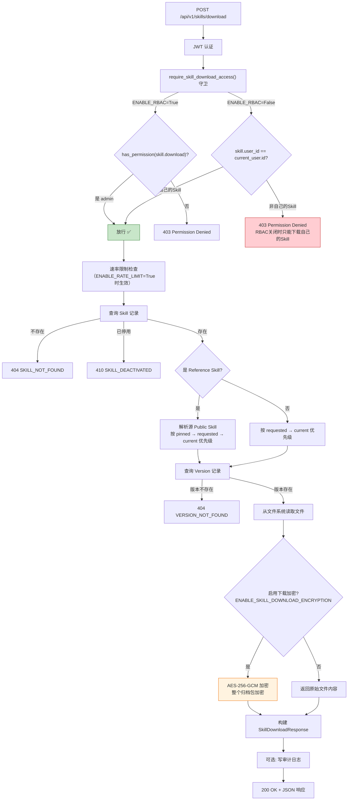
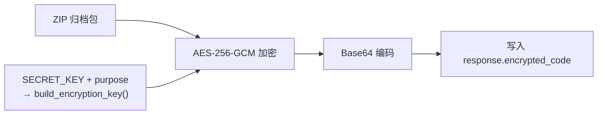

# 不开启 RBAC 情况下用户下载 Skill 的完整流程

> 本文档聚焦下载操作的端到端流程。权限模型和完整功能列表请参考 [feature-list-without-rbac.md](./feature-list-without-rbac.md)。

---

## 目录

- [整体流程](#整体流程)
- [接口详情](#接口详情)
- [下载加密](#下载加密)
- [速率限制](#速率限制)
- [前端下载体验](#前端下载体验)
- [错误码速查](#错误码速查)

---

## 整体流程



**RBAC 关闭后的关键变化**：下载权限不再是从 admin-only 变为人人可用，而是受 `require_skill_download_access()` 守卫约束——**只能下载自己拥有的 Skill**（`skill.user_id == current_user.id`）。这避免了 RBAC 关闭后任何人都能下载所有 Skill 源码的风险。

**间接通道**：用户可以下载自己创建的 Reference Skill（因为 Reference 的 `user_id` 是创建者），而 Reference 的文件实际来自源公共 Skill 的目录。这意味着用户通过 Reference 可以间接获取公共 Skill 的源文件——这是有意设计的，因为用户本来就能通过文件浏览接口（`GET /skills/{uuid}/files/{path}`）读取公共 Skill 的内容。与此同时，`public` Skill 本体已被业务规则明确禁止直接下载，必须先创建 `reference` 或 `clone`。

---

## 接口详情

### 请求

```
POST /api/v1/skills/download
Content-Type: application/json
```

```json
{
  "skill_uuid": "目标 Skill 的 UUID（必填）",
  "version": "1.0.0"              // 可选，省略则下载 current_version
}
```

### 响应

```json
{
  "skill_uuid": "abc-123",
  "version": "1.0.0",
  "encrypted_code": "base64 编码的归档内容...",
  "checksum": "sha256:abc123...",
  "expires_at": "2026-04-11T15:00:00Z",
  "cache_ttl_seconds": 300,
  "archive_size_bytes": 5678,
  "encryption_enabled": false,
  "download_filename": "skill-abc12345-1.0.0.json",
  "decryption_hint": null
}
```

关键字段说明：

- `encrypted_code` — 未加密时为整个 ZIP 归档包的 base64 编码；加密时为 AES-256-GCM 加密后的 base64 密文
- `checksum` — 归档内容的 SHA-256 校验和，格式为 `sha256:{hex}`
- `encryption_enabled` — 标识本次下载是否启用了加密
- `archive_size_bytes` — 归档包的字节大小
- `download_filename` — 建议的下载文件名（加密时后缀为 `.encrypted.json`，非加密时为 `.json`）
- `expires_at` — 下载链接的过期时间
- `decryption_hint` — 加密时提示信息，非加密时为 null

---

## 下载加密

当 `ENABLE_SKILL_DOWNLOAD_ENCRYPTION=True` 时，下载的整个归档包会被加密。



- 密钥派生：使用 `settings.SECRET_KEY` 和固定 purpose `"skill-download-encryption"` 通过 `build_encryption_key()` 生成 256 位 AES 密钥
- 加密方式：整个归档包作为一个整体加密，加密后 base64 编码存入 `encrypted_code` 字段
- 前端处理：当前前端直接将 API 响应序列化为 JSON 下载，不做客户端解密。如果启用加密，下载的文件内容将是密文，需要使用共享密钥在客户端或其他工具中解密

配置：
```env
ENABLE_SKILL_DOWNLOAD_ENCRYPTION=False  # 默认关闭
SECRET_KEY=your-secret-key              # 用于派生加密密钥
```

---

## 速率限制

当 `ENABLE_RATE_LIMIT=True` 时，下载接口受滑动窗口限流保护。

| 参数 | 默认值 | 说明 |
|------|--------|------|
| `SKILL_DOWNLOAD_RATE_LIMIT_REQUESTS` | 60 | 窗口内最大请求数 |
| `SKILL_DOWNLOAD_RATE_LIMIT_WINDOW` | 60 | 窗口宽度（秒） |

超出限制时返回：
```
429 Too Many Requests
{ "detail": "Too many download requests. Please try again later.", "code": "RATE_LIMIT_EXCEEDED" }
```

限流键为用户 ID（已登录）或客户端 IP（未登录场景），同一键在窗口内的请求计数超限即触发。

---

## 前端下载体验

### 入口位置

下载按钮在 **Skill 详情页 → 版本标签 → 选中单个版本后** 的操作按钮组中，与"安装说明"和"回滚"按钮并列。

```
┌─────────────────────────────────────────────────────────────┐
│  Skill: My Awesome Skill                                    │
│  [基本信息] [文件] [版本 ✓] [依赖] [设置]                    │
├────────────────────────┬────────────────────────────────────┤
│  版本列表              │     版本 1.0.0                     │
│  ┌──────────────────┐  │     ─────────────────────          │
│  ☑ 1.0.0 (当前)     │  │     创建于 2026-04-07 16:00       │
│  ☐ 0.9.0            │  │                                     │
│  └──────────────────┘  │     ┌──────────┬──────────┬──────┐ │
│                        │     │ 安装说明  │  下载    │ 回滚 │ │
│                        │     └──────────┴──────────┴──────┘ │
└────────────────────────┴────────────────────────────────────┘
```

### 前端处理逻辑

```
1. 调用后端 API: POST /api/v1/skills/download
2. 接收 JSON 响应（包含 encrypted_code、元数据等）
3. JSON.stringify() 序列化为格式化字符串
4. 创建 Blob 对象 + 生成临时 Object URL
5. 触发浏览器原生下载
6. 文件名格式: skill-{uuid前8位}-{version}.json（加密时为 .encrypted.json）
7. 清理临时 DOM 元素和 Object URL
```

前端不区分加密与非加密——两种情况下都是直接将 API 响应整体下载为 JSON 文件。加密场景下需要在下载后使用外部工具解密。

---

## 错误码速查

| 场景 | HTTP 状态码 | 错误码 |
|------|------------|--------|
| Skill 不存在 | 404 | `SKILL_NOT_FOUND` |
| Skill 已停用 | 410 | `SKILL_DEACTIVATED` |
| 指定版本不存在 | 404 | `VERSION_NOT_FOUND` |
| 版本文件目录缺失 | 404 | `VERSION_FILES_NOT_FOUND` |
| 下载包过大 | 413 | `DOWNLOAD_TOO_LARGE`（含大小信息） |
| 速率超限 | 429 | `RATE_LIMIT_EXCEEDED` |
| 公共 Skill 功能未启用 | 404 | `PUBLIC_SKILLS_DISABLED` |
| 非自己的 Skill（RBAC 关闭） | 403 | Permission denied |
| 未登录 | 401 | 无有效 JWT |

---

## 安全边界

RBAC 关闭后，以下机制**仍然生效**：

| 安全层 | 说明 |
|--------|------|
| JWT 认证 | 必须携带有效 Token，验签+过期校验 |
| 用户活跃状态 | `is_active=True` 才能通过 |
| Token 版本校验 | `jwt_token_version` 防重放攻击 |
| Skill 可见性控制 | 可选，取决于 `ENABLE_SKILL_VISIBILITY` |
| 路径遍历防护 | 文件系统安全 |
| 下载大小限制 | 避免超大响应 |
| 速率限制 | 可选，防止滥用 |
| 审计日志 | 可选，取决于 `ENABLE_AUDIT_LOG` |

**RBAC 关闭后被替换的**：角色权限验证从 `skill.download`（admin-only）变为 `require_skill_download_access()`（仅自己的 Skill）。

---

## 配置汇总

```env
# 下载权限
ENABLE_RBAC=False                        # 关闭后只能下载自己拥有的 Skill

# 下载安全
ENABLE_SKILL_DOWNLOAD_ENCRYPTION=False   # 下载加密
ENABLE_RATE_LIMIT=False                  # 速率限制
SKILL_DOWNLOAD_RATE_LIMIT_REQUESTS=60    # 窗口内最大请求数
SKILL_DOWNLOAD_RATE_LIMIT_WINDOW=60      # 窗口宽度(秒)

# 审计
ENABLE_AUDIT_LOG=False                   # 下载操作审计
```
