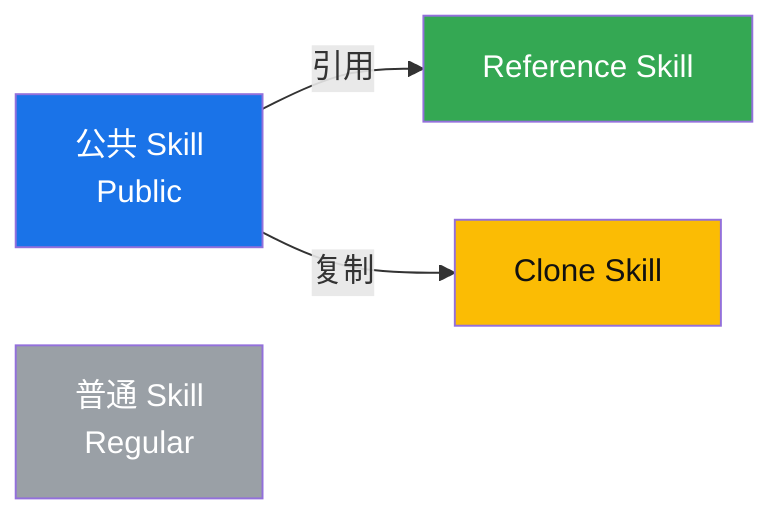
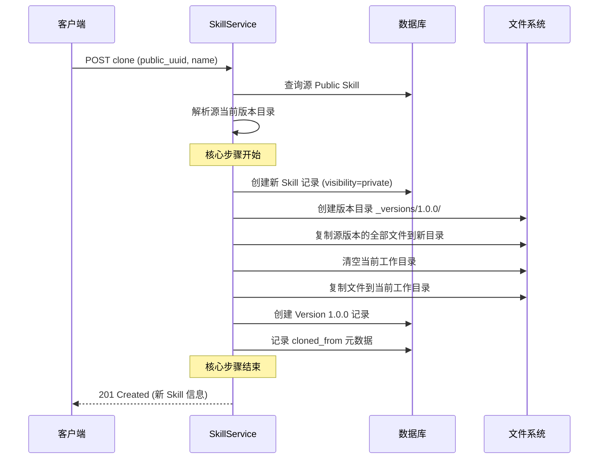
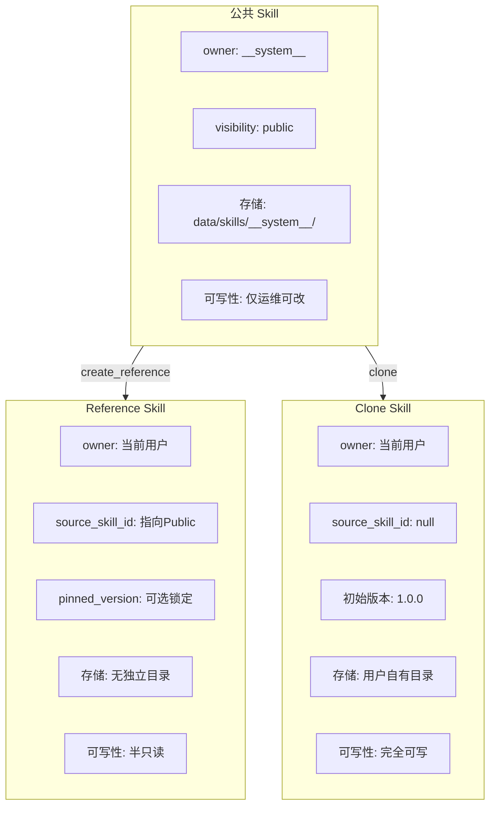
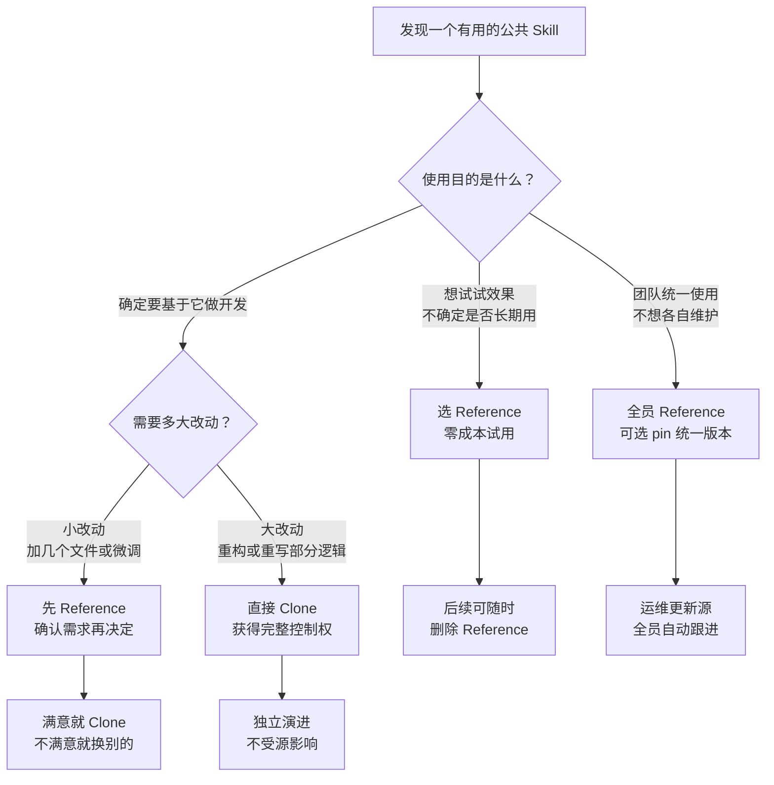
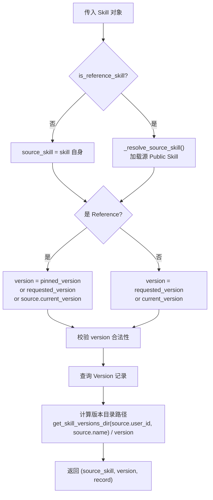

# Public Skill、Reference Skill 与 Clone Skill 详解

> 三种 Skill 类型构成了"浏览 → 试用 → 定制"的渐进式技能获取路径。本文件详解其设计动机、行为差异和实现机制。

---

## 目录

- [背景与动机](#背景与动机)
- [公共 Skill (Public)](#公共-skill-public)
- [Reference Skill (引用)](#reference-skill-引用)
- [Clone Skill (克隆)](#clone-skill-克隆)
- [三者对比与选择指南](#三者对比与选择指南)
- [统一版本解析机制](#统一版本解析机制)
- [数据模型](#数据模型)
- [API 接口与错误码](#api-接口与错误码)
- [设计约束](#设计约束)

---

## 背景与动机

在个人私有化部署场景下，系统需要解决一个核心问题：**如何让新用户快速获得可用技能，同时保留自定义和二次开发的空间？**

在没有引入三种类型之前，用户获取可用技能只有两个极端选项，缺乏中间地带：

**极端一：从零自建。** 用户注册后面对一片空白，所有 Skill 都要自己从头写代码、配依赖、打包 ZIP 再上传。这就像买了一台空电脑，操作系统、驱动、软件全得自己装 —— 门槛高、效率低，新手可能折腾半天还跑不起来第一个 Skill。

**极端二：固定模板。** 系统预置几个 Skill，但它们是"死"的：用户只能原样使用，作者后续发布的更新拿不到（无法更新），想基于它改造也没有独立副本可以操作（难以维护）。这就像买了一个预装软件的电脑，但软件版本永远冻结在出厂那天。

本项目引入 Public、Reference、Clone 三种类型，在上述两个极端之间建立了一条**渐进式路径**：



三种类型的关系可以概括为：**公共 Skill 是源头，Reference 是轻量指针，Clone 是独立副本，普通 Skill 是用户自建。**

---

## 公共 Skill (Public)

公共 Skill 是由系统管理员预置的、所有登录用户均可访问的只读技能包。它存储在服务端的专用目录下，由一个保留的系统账号 (`__system__`) 在数据库中承载所有权。

| 属性 | 值 |
|------|-----|
| `visibility` | `public` |
| `owner` | 系统保留账号 (`SYSTEM_USER_ID`) |
| 存储路径 | `data/skills/__system__/{skill_name}/` |
| 可写性 | 仅运维可通过文件系统 + 同步脚本修改 |

### 定位

类似于 npm 上的官方包、PyPI 上的热门库、或者操作系统中预装的工具。它解决的是"冷启动"问题 —— 新用户注册后无需任何配置就能立即开始使用。

典型使用场景：

- **数据分析类**: 预置 Python 数据处理脚本，包含 pandas、numpy 依赖声明
- **文档转换类**: 预置 Markdown 转 PDF 的完整工具链
- **代码生成类**: 预置脚手架模板，支持快速初始化项目结构
- **AI 能力类**: 预置与大模型交互的标准化 prompt 模板

### 可用操作

**用户可以**：浏览列表、查看详情/文件/版本、读取文件内容、执行、下载、创建 Reference 或 Clone。

**用户不可以**：修改任何内容（返回 `REFERENCE_SKILL_READ_ONLY`）、删除或停用、上传文件。

**运维可以**：将文件放入 `data/skills/__system__/` 对应目录，然后运行同步脚本 `sync_public_skills.py` 更新数据库记录。同步脚本会自动创建 Skill 记录、Version 记录、归档文件。

### 设计要点

**单一发布入口** — 公共 Skill 不通过 Web API 或管理后台发布。唯一的写入路径是服务器文件系统 + 同步脚本。这避免了权限边界模糊、确保变更可审计、与 CI/CD 流程天然兼容。

**数据与文件的分离存储** — 数据库中公共 Skill 的 owner 是真实的系统账号 UUID（满足外键约束），但文件系统上使用语义化的 `__system__` 目录名（提升可读性）。两者通过 `resolve_storage_owner()` 函数映射：

```python
# backend/core/utils/skill_storage.py
SYSTEM_USER_ID = "00000000-0000-0000-0000-000000000001"
SYSTEM_STORAGE_OWNER = "__system__"

def resolve_storage_owner(user_id: str) -> str:
    return SYSTEM_STORAGE_OWNER if user_id == SYSTEM_USER_ID else user_id
```

**幂等同步** — 同步脚本的设计保证重复执行不会产生副作用。已存在的记录以文件系统为准进行更新，缺失的记录自动补齐，被删除的目录对应的 Skill 标记为失效但不物理删除。

**条件启用** — 公共 Skill 功能仅在同时满足两个条件时生效：`ENABLE_SKILL_VISIBILITY=true` 且 `ENABLE_RBAC=false`。这意味着它专为个人私有化场景设计，不与企业级 RBAC 的 `team/enterprise` 可见性冲突。

---

## Reference Skill (引用)

Reference Skill 是用户创建的"轻量级引用记录"。它不在用户的目录下复制任何文件，而是在数据库中保存一条指向源公共 Skill 的指针，运行时动态解析到源 Skill 的版本目录。

| 属性 | 值 |
|------|-----|
| `visibility` | `private`（用户私有） |
| `source_skill_id` | 指向源公共 Skill 的 ID（非空） |
| `pinned_version` | 锁定的版本号（可为 null） |
| 存储路径 | 无独立目录 |
| 文件来源 | 运行时从源 Skill 读取 |

判定逻辑：**只要 `source_skill_id` 字段不为空，就是 Reference Skill。**

```python
@staticmethod
def is_reference_skill(skill: Skill) -> bool:
    source_skill_id = getattr(skill, "source_skill_id", None)
    return isinstance(source_skill_id, str) and bool(source_skill_id.strip())
```

### 定位

类似于 Node.js 中的 `npm link`、Python 中的 `pip install -e`（可编辑安装）、或 Git 中的 symbolic reference。核心价值是让用户在不复制文件的前提下使用公共 Skill。

适用场景：

- **试用评估**: 想先体验公共 Skill 的效果，再决定是否深入使用
- **始终跟随最新**: 信任源 Skill 的维护者，希望自动获取更新
- **节省存储空间**: 多个用户共享同一份文件副本，不产生冗余
- **团队基准统一**: 团队成员各自创建 Reference，确保使用相同版本的 Skill

### 版本解析策略

这是 Reference Skill 最关键的特性。当任何操作（读取文件、下载、执行等）需要确定"到底用哪个版本的文件"时，系统按以下优先级解析：

```
pinned_version（用户主动锁定的版本）
       ↓ 如果为 null
requested_version（本次请求指定的 version 参数）
       ↓ 如果为 null
source_skill.current_version（源 Skill 当前最新版本）
```

对应代码实现：

```python
if self.is_reference_skill(skill):
    version = str(
        skill.pinned_version or requested_version or source_skill.current_version or ""
    )
else:
    version = str(requested_version or source_skill.current_version or "")
```

这意味着：

- **未 pin 且不指定版本**: 自动跟随源 Skill 的最新版本。源作者发布了 `2.0.0`，你的 Reference 下次执行就会用 `2.0.0`
- **pin 到具体版本**: 比如 pin 了 `"1.5.0"`，无论源怎么更新，你的 Reference 始终使用 `1.5.0` 的文件
- **临时指定版本**: 调用时传入 `version="1.8.0"` 可以临时覆盖 pinned 版本，但不修改 pin 记录本身

#### 下载时的版本选择行为

下载、读文件、执行、列文件等所有操作共享同一套版本解析逻辑，下载并没有特殊待遇。

假设公共 Skill `python-data-analyzer` 当前已有版本 `1.0.0`、`1.5.0`、`2.0.0`、`2.1.0`，其中 `current_version = "2.1.0"`：

| 场景 | Reference 状态 | 用户请求 | 实际下载的版本 | 原因 |
|------|---------------|---------|--------------|------|
| A | `pinned_version = "2.0.0"` | 不传 version | **`2.0.0`** | pinned 优先级最高 |
| B | `pinned_version = "2.0.0"` | `version = "1.5.0"` | **`1.5.0`** | requested_version 覆盖了 pinned（仅本次） |
| C | `pinned_version = null` | 不传 version | **`2.1.0`** | fallback 到源的 current_version |
| D | `pinned_version = null` | `version = "1.0.0"` | **`1.0.0`** | requested_version 直接生效 |

**场景 A 的完整数据流**（核心场景）：

```
步骤 1: get_skill() → 找到 Reference 记录
步骤 2: is_reference_skill() → True
步骤 3: _resolve_source_skill() → 加载 Public Skill (current_version = "2.1.0")
步骤 4: 版本解析: pinned_version = "2.0.0"  ✓ 非空，直接采用
步骤 5: 定位目录: data/skills/__system__/python-data-analyzer/_versions/2.0.0/
步骤 6: 打包该目录下所有文件
步骤 7: 返回响应 { version: "2.0.0", ... }
```

**如果去掉 pinned 优先策略会怎样？**

用户明确锁定了 `2.0.0`，却拿到了 `2.1.0` 的文件。这会破坏用户预期、丧失环境一致性、无法通过重新下载恢复到已知状态。因此 `pinned_version` 不仅是展示字段，更是运行时行为控制开关。

**与普通 Skill 的对比**：普通 Skill 只有二级 fallback（请求指定版本 → 自身当前版本），Reference Skill 有三级（**pinned → 请求指定 → 源当前**）。多出来的这一级就是 Reference Skill 的核心所在。

### Pin / Unpin 操作

```http
PUT /api/v1/skills/{reference_uuid}/pin
Body: { "version": "2.1.0" }   →  锁定到 2.1.0

PUT /api/v1/skills/{reference_uuid}/unpin   →  取消锁定，恢复跟随最新
```

Pin 操作会验证目标版本是否存在于源 Skill，不存在则返回 `VERSION_NOT_FOUND`。

### 权限边界

Reference Skill 是"半只读"实体。

**允许的操作**：查看详情、列出文件、读取文件、执行、下载、查看版本列表、版本对比 (diff)、重命名（只改 name 字段）、Pin / Unpin、删除（仅删引用记录，不影响源 Skill）。

**禁止的操作**：

| 操作 | 结果 |
|------|------|
| 修改 description / tags / visibility | 返回 `409 REFERENCE_SKILL_READ_ONLY` |
| 上传单个文件 | 返回 `409 REFERENCE_SKILL_READ_ONLY` |
| 上传 ZIP 更新 | 返回 `409 REFERENCE_SKILL_READ_ONLY` |
| 停用 / 启用 | 引用不具备独立生命周期 |

### 设计要点

**指针而非拷贝** — Reference 在数据库中只是一条记录（几十字节的元数据），不占用任何磁盘存储。当源 Skill 有 100 个文件共 50MB 时，1000 个用户创建 Reference 不会多占用 1KB。

**用户可控的稳定性** — 通过 `pinned_version`，用户可以在"跟随最新"和"锁定版本"之间自由切换，解决依赖升级焦虑。

**透明的重定向** — 对调用方而言，Reference Skill 的接口与普通 Skill 完全一致。区别仅在内部实现层：普通 Skill 读自己的目录，Reference Skill 通过 `_resolve_source_skill()` 解析后读源的目录。上层代码不需要为 Reference 写特殊分支。

---

## Clone Skill (克隆)

Clone Skill 是从公共 Skill **完整复制**出来的独立私有 Skill。复制完成后，它与源 Skill 再无任何关联，拥有自己的目录、版本序列和完整的生命周期。

| 属性 | 值 |
|------|-----|
| `visibility` | `private`（默认） |
| `source_skill_id` | `null`（切断关联） |
| `pinned_version` | `null` |
| 存储路径 | `data/skills/{user_id}/{skill_name}/`（用户自有目录） |
| 文件来源 | 从源 Skill 复制出的独立副本 |

判定逻辑：一个 Skill 既不是 Reference（`source_skill_id` 为空），也不是公共 Skill（`visibility != public`），且其首个版本的 `metadata_json` 中包含 `cloned_from_skill_id` 字段，则判定为 Clone Skill。

### 定位

类似于 `git clone`、`npm pack` + 本地安装、或"另存为"。当需要对公共 Skill 做深度定制时，Clone 是正确选择。

典型场景：

- **功能扩展**: 在公共 Skill 的基础上添加新的命令或工具
- **适配改造**: 修改依赖版本、替换底层实现以适应本地环境
- **长期维护**: 创建一个 fork 后长期独立迭代
- **安全隔离**: 将外部代码纳入内部审查流程后再使用

### 创建流程



Clone 一旦创建完成，就变成了一个完全普通的私有 Skill，支持所有普通 Skill 的操作：上传文件、创建新版本、版本回滚、停用/启用、删除、修改元数据。

### 与源 Skill 的关系

Clone 的来源信息仅保存在首条 Version 记录的 `metadata_json` 中，作为纯信息字段：

```json
{
  "cloned_from_skill_id": "原始公共Skill的UUID",
  "cloned_from_version": "2.1.0"
}
```

这段数据**不参与任何运行时逻辑**。源 Skill 后续的更新不会通知到 Clone，Clone 的变更也不会影响源 Skill。两者彻底解耦。

### 设计要点

**完全隔离** — Clone 产生的不仅是文件副本，还有独立的版本线。源 Skill 可能已经迭代到 `5.0.0`，而 Clone 可能还在 `1.0.0` 并按照自己的节奏演进。

**干净的起始点** — Clone 的初始版本固定为 `1.0.0`，而不是继承源 Skill 的版本号。这是刻意的选择：既然是独立分支，就应该有自己的版本语义。继承版本号会造成"我明明只改了一行代码，为什么版本号是 `2.1.0`"的困惑。

**来源可追溯但不绑定** — `metadata_json` 中记录了克隆来源，但这只是元数据层面的标记。系统不会因为这条记录就限制 Clone 的行为。

---

## 三者对比与选择指南

### 核心差异总览



### 详细对比

| 维度 | 公共 Skill | Reference Skill | Clone Skill | 普通 Skill |
|------|-----------|----------------|-------------|-----------|
| **创建方式** | 运维同步脚本 | `POST /{id}/reference` | `POST /{id}/clone` | 上传 ZIP / 创建 |
| **文件存储位置** | `__system__/` 目录 | 无（指向源） | 用户自有目录 | 用户自有目录 |
| **是否复制文件** | 原始文件 | 否，零拷贝 | 是，完整复制 | 用户上传 |
| **存储开销** | 一份 | 接近零 | 一份完整副本 | 一份 |
| **可见性** | public（全员可见） | private（仅自己可见） | private（默认） | private/team/enterprise |
| **能否编辑** | 不能（普通用户） | 不能（只能改名/pin） | 完全可以 | 完全可以 |
| **版本跟随** | 自身迭代 | 可选跟随或锁定 | 独立迭代 | 独立迭代 |
| **删除影响** | 影响所有 Reference | 仅删引用记录 | 删自身及文件 | 删自身及文件 |
| **适用阶段** | 试用 / 生产基线 | 快速体验 / 团队统一定制 | 深度改造 / 长期维护 | 完全自建 |
| **类比** | npm 官方包 | npm link | git fork + clone | 自己写的包 |

### 如何选择



决策建议：

- **犹豫不决时，先用 Reference**。创建和删除都是轻量操作，没有任何资源负担。试用满意后再考虑是否 Clone。
- **需要改动代码时，必须 Clone**。Reference 不允许任何文件写入操作，如果需要定制功能，Clone 是唯一选择。
- **团队协作场景下，推荐 Reference + pin**。团队成员各自创建 Reference 到同一个公共 Skill 并 pin 到相同版本，既能统一基线，又能在需要时灵活切换。

---

## 统一版本解析机制

引入 Reference Skill 后，所有需要定位版本目录的操作都必须经过统一的解析函数，避免各入口各自写 if-else 分支导致不一致。

### 解析流程



### 受影响的操作入口

| 操作 | 方法 |
|------|------|
| 下载 Skill | `download_skill()` |
| 列出文件 | `list_skill_files()` |
| 读取文件 | `read_skill_file()` |
| 获取安装指令 | `get_install_instructions()` |
| 版本对比 | `diff_versions()` |
| 执行 Skill | `execute_skill_op.py`（通过 resolve 接入） |
| MCP 资源操作 | `skill_resource_ops.py`（通过 resolve 接入） |

这种集中解析方式保证了：无论从哪个入口访问 Reference Skill，都能正确定位到源 Skill 的对应版本目录。

---

## 数据模型

### skills 表相关字段

```sql
CREATE TABLE skills (
    id              VARCHAR(36) PRIMARY KEY,
    user_id         VARCHAR(36) NOT NULL REFERENCES users(id),
    name            VARCHAR(200) NOT NULL,
    description     TEXT,
    tags            JSONB,
    visibility      VARCHAR(20) NOT NULL DEFAULT 'private',

    -- 公共 Skill / Reference 相关字段
    source_skill_id VARCHAR(36) NULL REFERENCES skills(id) ON DELETE SET NULL,
    pinned_version  VARCHAR(50) NULL,

    skill_dir       VARCHAR(500) NOT NULL DEFAULT '',
    current_version VARCHAR(50) NULL,
    is_active       BOOLEAN NOT NULL DEFAULT TRUE,
    created_at      TIMESTAMPTZ NOT NULL DEFAULT NOW(),
    updated_at      TIMESTAMPTZ NOT NULL DEFAULT NOW()
);

CREATE INDEX idx_skills_source_skill_id ON skills(source_skill_id);
```

### 三种类型的数据库形态

```
┌─────────────────────────────────────────────────────────────┐
│  公共 Skill                                                  │
│  id = 'aaa...'                                              │
│  user_id = SYSTEM_USER_ID ('000...001')                     │
│  name = 'python-data-analyzer'                              │
│  visibility = 'public'                                      │
│  source_skill_id = NULL                                     │
│  pinned_version = NULL                                      │
│  current_version = '2.1.0'                                  │
└─────────────────────────────────────────────────────────────┘
                            │
           ┌────────────────┼────────────────┐
           │ create_reference               │ clone
           ▼                                ▼
┌──────────────────────────┐  ┌──────────────────────────┐
│  Reference Skill          │  │  Clone Skill              │
│  id = 'bbb...'            │  │  id = 'ccc...'            │
│  user_id = 'user-123'     │  │  user_id = 'user-123'     │
│  name = 'my-analyzer'     │  │  name = 'my-analyzer-fork'│
│  visibility = 'private'   │  │  visibility = 'private'   │
│  source_skill_id = 'aaa..'│  │  source_skill_id = NULL   │
│  pinned_version = '2.0.0' │  │  pinned_version = NULL     │
│  current_version = NULL   │  │  current_version = '1.0.0' │
│  skill_dir = ''           │  │  skill_dir 正常填充        │
└──────────────────────────┘  └──────────────────────────┘
```

---

## API 接口与错误码

### 消费端接口

| 方法 | 路径 | 作用 |
|------|------|------|
| `GET` | `/api/v1/skills/public` | 浏览公共 Skill 列表 |
| `GET` | `/api/v1/skills/public/{uuid}` | 查看公共 Skill 详情 |
| `POST` | `/api/v1/skills/{public_uuid}/reference` | 基于 Public 创建 Reference |
| `POST` | `/api/v1/skills/{public_uuid}/clone` | 基于 Public 创建 Clone |
| `PUT` | `/api/v1/skills/{ref_uuid}/pin` | 锁定 Reference 版本 |
| `PUT` | `/api/v1/skills/{ref_uuid}/unpin` | 取消锁定，恢复跟随最新 |

### 请求/响应示例

**创建 Reference**:

```http
POST /api/v1/skills/{public_uuid}/reference
Content-Type: application/json

{
  "name": "my-data-analyzer",
  "pinned_version": null
}

Response 201:
{
  "id": "reference-uuid",
  "name": "my-data-analyzer",
  "visibility": "private",
  "source_skill_id": "public-uuid",
  "pinned_version": null,
  "resolved_version": "2.1.0",
  "skill_kind": "reference",
  "is_reference_read_only": true
}
```

**创建 Clone**:

```http
POST /api/v1/skills/{public_uuid}/clone
Content-Type: application/json

{
  "name": "my-custom-analyzer",
  "visibility": "private"
}

Response 201:
{
  "id": "clone-uuid",
  "name": "my-custom-analyzer",
  "current_version": "1.0.0",
  "skill_kind": "clone"
}
```

**锁定版本**:

```http
PUT /api/v1/skills/{ref_uuid}/pin
Content-Type: application/json

{ "version": "2.0.0" }

Response 200:
{
  "id": "reference-uuid",
  "pinned_version": "2.0.0",
  "resolved_version": "2.0.0"
}
```

### 错误码速查

| 场景 | HTTP 状态码 | 错误码 |
|------|------------|--------|
| 公共能力未启用 | 404 | `PUBLIC_SKILLS_DISABLED` |
| 源 Skill 不存在 | 404 | `SKILL_NOT_FOUND` |
| 目标 Skill 不是公共的 | 400 | `SKILL_NOT_PUBLIC` |
| 名称已被占用 | 409 | `SKILL_ALREADY_EXISTS` |
| Reference 上尝试写操作 | 409 | `REFERENCE_SKILL_READ_ONLY` |
| Pin 到不存在的版本 | 404 | `VERSION_NOT_FOUND` |
| 源 Skill 已失效/停用 | 409 | `SOURCE_SKILL_UNAVAILABLE` |

---

## 设计约束

### 启用条件

公共 Skill 及其衍生能力**仅在以下条件同时满足时可用**：

```
ENABLE_SKILL_VISIBILITY = true   （可见性系统开启）
ENABLE_RBAC = false             （RBAC 关闭，即个人部署模式）
```

任一条件不满足时：
- `/api/v1/skills/public*` 路由不注册
- reference / clone / pin / unpin 接口不暴露
- `visibility = public` 视为保留值，不产生实际效果

### 不做的事项

以下是明确**不在本期实现**的功能，避免误解：

- 不做社区投稿、审核流、评分系统
- 不允许普通用户通过 Web/API 直接修改公共 Skill
- 不改变企业 RBAC 模式下 `private/team/enterprise` 的既有语义
- 不提供公共 Skill 的评论、反馈、star 收藏机制
- 不做跨实例的 Skill 共享（每个部署实例的公共 Skill 独立维护）

---

## 总结

三种 Skill 类型构成了一个分层的技能生态：

**公共 Skill 是基础设施层**。由运维维护、全员共享、代表经过验证的稳定能力，是整个体系的源头和基线。

**Reference Skill 是便捷接入层**。以接近零的成本让用户立即使用公共 Skill，同时通过 `pinned_version` 提供可选的稳定性保障，是"先用起来"的最佳入口。

**Clone Skill 是深度定制层**。在公共 Skill 的基础上提供一个干净的起点，用户可以任意改造而不影响源或其他用户，是"我要自己做"的正确路径。

三者的递进关系反映了真实世界中的软件消费模式：**浏览 → 试用 → 定制**。每一层都比上一层承担更多责任（存储、维护、版本管理），同时也获得更多自由度（可写、可改、可控）。
