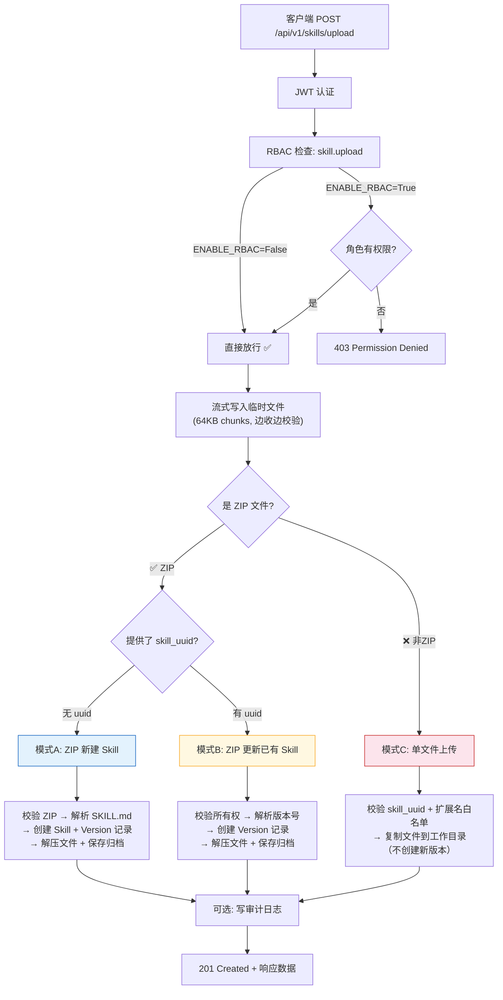
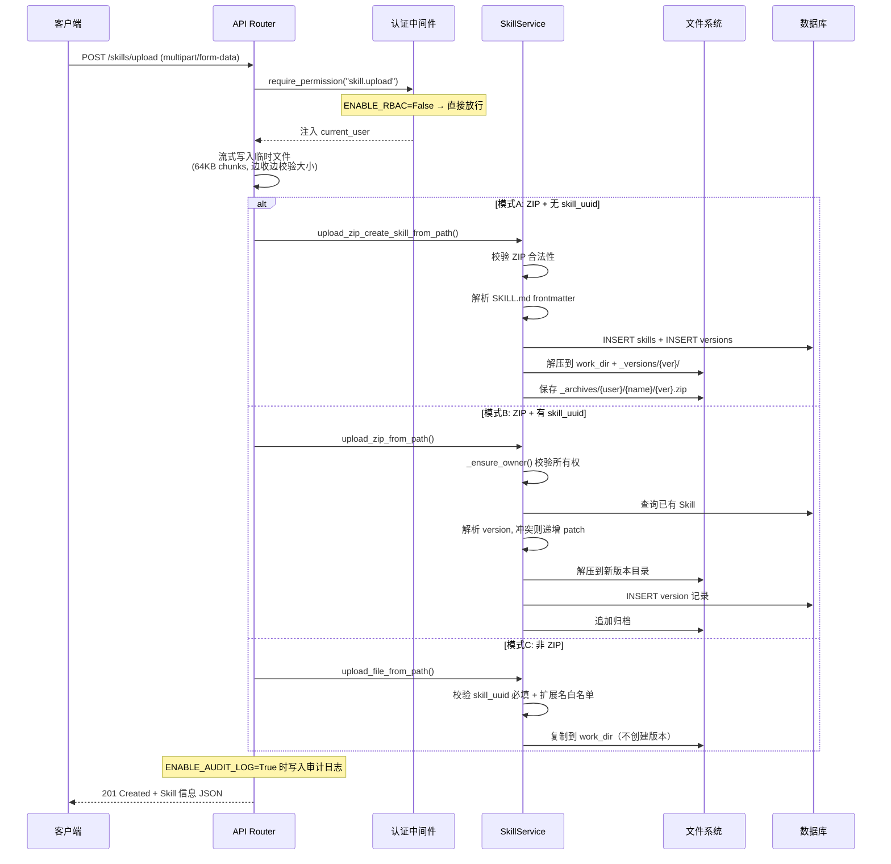

# 不开启 RBAC 情况下用户上传 Skill 的完整流程

> 本文档聚焦上传操作的端到端流程。权限模型和完整功能列表请参考 [feature-list-without-rbac.md](./feature-list-without-rbac.md)。

---

## 目录

- [整体流程](#整体流程)
- [三种上传模式](#三种上传模式)
- [端到端时序](#端到端时序)
- [存储结构](#存储结构)
- [安全限制](#安全限制)
- [错误码速查](#错误码速查)

---

## 整体流程



**RBAC 关闭后的简化路径**：客户端携带有效 JWT → 通过认证 → 权限检查直接放行 → 进入业务逻辑。唯一被跳过的是角色/权限矩阵校验，JWT 认证本身始终生效。

---

## 三种上传模式

上传接口 `POST /api/v1/skills/upload` 接受 `multipart/form-data`，根据文件类型和参数组合走三条路径。

### 模式 A：ZIP 新建 Skill

**条件**：上传 `.zip` 文件，且不提供 `skill_uuid`。

这是"从零创建一个新 Skill"的标准方式。系统会做以下事情：

1. **校验 ZIP** — 确保非空、文件数不超过 50、总大小不超过 100MB
2. **解析 SKILL.md** — ZIP 内必须包含此文件。系统从 YAML frontmatter 提取：
   - `name`（必填）：Skill 名称
   - `description`：描述信息
   - `version`：版本号（默认 `1.0.0`）
   - `dependencies` / `dependency_spec`：依赖声明
3. **自动检测依赖类型** — 发现 `pyproject.toml`/`requirements.txt` 视为 Python，发现 `package.json` 视为 Node
4. **写入数据库** — 创建 Skill 记录 + Version 记录
5. **写入文件系统** — 解压到工作目录和版本快照目录，保存原始 ZIP 到归档目录
6. **校验名称唯一性** — 同一用户下不允许重名

### 模式 B：ZIP 更新已有 Skill

**条件**：上传 `.zip` 文件，且提供 `skill_uuid`。

这是给已有 Skill 发布新版本的方式。与模式 A 的区别：

- **所有权校验**：调用 `_ensure_owner()` 检查 `skill.user_id == current_user.id`，非所有者会被拒绝
- **版本冲突处理**：如果 SKILL.md 中的版本号与已有版本重复，自动递增 patch 号（如 `1.0.0` → `1.0.1`）
- **元数据覆盖**：支持通过 `metadata` 参数覆盖 version/description，不修改 SKILL.md 也能控制版本号

### 模式 C：单文件追加

**条件**：上传非 ZIP 文件，且提供 `skill_uuid`。

这是往已有 Skill 中追加单个文件的方式，最轻量但限制也最多：

- **必须提供** `skill_uuid`，否则返回 400
- 单文件大小不超过 10MB
- 文件扩展名必须在白名单内（33 种，包括 `.py`、`.md`、`.json`、`.yaml` 等）
- 不创建新版本号，文件直接复制到 Skill 的当前工作目录

### 三种模式速查

| | 模式 A — ZIP 新建 | 模式 B — ZIP 更新 | 模式 C — 单文件追加 |
|---|---|---|---|
| **触发条件** | ZIP + 无 skill_uuid | ZIP + 有 skill_uuid | 非 ZIP + 有 skill_uuid |
| **是否需要 SKILL.md** | 必须包含 | 可选（metadata 可替代） | 不需要 |
| **是否创建版本** | 是（v1.0.0） | 是（递增版本号） | 否 |
| **所有权检查** | 不涉及 | 必须是 Skill 所有者 | 必须是 Skill 所有者 |
| **大小限制** | 100MB（ZIP 总量） | 100MB（ZIP 总量） | 10MB（单文件） |
| **文件数限制** | ≤50 | ≤50 | 受已有文件数+1 ≤50 约束 |

---

## 端到端时序



---

## 存储结构

以用户 `user-abc` 的 Skill `my-analyzer` 版本 `1.2.0` 为例：

```
data/
├── skills/
│   └── user-abc/
│       └── my-analyzer/              ← 当前工作目录（最新版本文件展开）
│           ├── SKILL.md
│           ├── main.py
│           ├── requirements.txt
│           └── _versions/
│               ├── 1.0.0/            ← 版本快照
│               │   ├── SKILL.md
│               │   ├── main.py
│               │   └── requirements.txt
│               └── 1.2.0/            ← 版本快照
│                   ├── SKILL.md
│                   ├── main.py
│                   └── requirements.txt
└── _archives/
    └── user-abc/
        └── my-analyzer/
            ├── 1.0.0.zip            ← 原始上传包备份
            └── 1.2.0.zip
```

三个位置各司其职：

- **工作目录**（`my-analyzer/`）：存放当前版本的文件，前端浏览和执行时读取此处
- **版本快照**（`_versions/`）：每个版本创建时留存的只读副本，回滚和下载时使用
- **归档目录**（`_archives/`）：保存用户上传的原始 ZIP 包，用于下载时直接打包返回

---

## 安全限制

以下安全机制在 RBAC 关闭时**仍然完全生效**：

| 限制项 | 值 | 触发后果 | 实现位置 |
|--------|-----|----------|----------|
| 单文件大小 | 10 MB | 413 FILE_TOO_LARGE | `skill_storage.py` |
| Skill 总大小 | 100 MB | 400 TOTAL_SKILL_SIZE_LIMIT_EXCEEDED | `skill_storage.py` |
| 文件数量上限 | 50 个 | 400 TOO_MANY_FILES | `skill_storage.py` |
| 文件扩展名 | 33 种白名单 | 400 INVALID_FILENAME | `skill_storage.py` |
| 路径遍历防护 | 拦截 `../` | 400 INVALID_FILE_PATH | `skill_storage.py` |
| Skill 名称格式 | 字母数字+连字符 | 400 INVALID_SKILL_NAME | `skill_storage.py` |
| 所有权验证 | `_ensure_owner()` | 403 权限不足 | `services/skill.py` |

RBAC 关闭后被跳过的检查：
- 角色权限验证（admin/member/viewer）
- 细粒度操作授权（如 RBAC 开启时 viewer 无 `skill.upload` 权限）

---

## 错误码速查

| 场景 | HTTP 状态码 | 错误码 |
|------|------------|--------|
| ZIP 文件为空 | 400 | `ZIP_EMPTY` |
| ZIP 内缺少 SKILL.md | 400 | `SKILL_MD_NOT_FOUND_IN_ZIP` |
| SKILL.md 缺少 name 字段 | 400 | `SKILL_MD_NAME_MISSING` |
| 非法 ZIP 格式 | 400 | `INVALID_ZIP_FILE` |
| Skill 名称已被占用 | 409 | `SKILL_ALREADY_EXISTS` |
| 非法 Skill 名称 | 400 | `INVALID_SKILL_NAME` |
| 文件名含非法字符 | 400 | `INVALID_FILENAME` |
| 文件过大 | 413 | `FILE_TOO_LARGE` |
| 文件数超限 | 400 | `TOO_MANY_FILES` |
| Skill 总大小超限 | 400 | `TOTAL_SKILL_SIZE_LIMIT_EXCEEDED` |
| 版本号已存在 | 400 | `VERSION_ALREADY_EXISTS` |
| 非 ZIP 上传缺少 skill_uuid | 400 | 请求参数错误 |
| Reference Skill 尝试上传 | 409 | `REFERENCE_SKILL_READ_ONLY` |

---

## 配置开关

影响上传行为的配置项（`backend/.env`）：

```env
ENABLE_RBAC=False              # 关闭后所有权限检查放行
DEFAULT_ROLE=member            # RBAC 关闭时不生效
ENABLE_SKILL_VISIBILITY=False  # 关闭后只能看到自己的 Skills
SKILL_STORAGE_PATH=/data/skills
SKILL_ARCHIVE_BACKEND=local    # 归档存储后端：local 或 s3
ENABLE_AUDIT_LOG=False         # 开启后记录上传审计事件
```

存储限制为硬编码（不可通过配置修改）：
- `MAX_FILE_SIZE = 10MB`
- `MAX_TOTAL_SIZE = 100MB`
- `MAX_FILES = 50`
