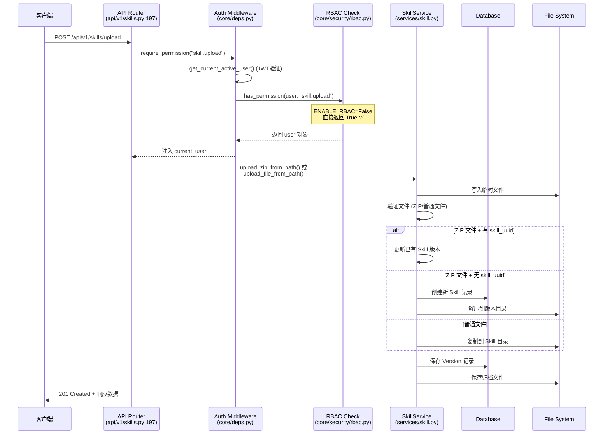
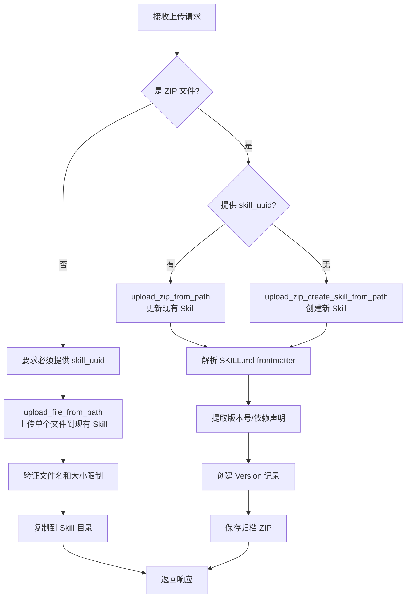

# 不开启 RBAC 情况下用户上传 Skill 的完整流程

基于代码分析，以下是完整的上传流程：

## 一、整体架构流程图



---

## 二、关键代码路径详解

### 1. 入口：API 路由层

**文件**: `backend/api/v1/skills.py:197-279`

```python
@router.post("/upload", status_code=status.HTTP_201_CREATED)
async def upload_skill_file(
    request: Request,
    file: UploadFile = File(...),
    skill_uuid: str | None = Form(None),
    visibility: str = Form("private"),
    metadata: str | None = Form(None),
    current_user=Depends(require_permission("skill.upload")),  # ← 权限检查点
    session=Depends(get_async_session),
):
```

**请求参数**：

| 参数 | 类型 | 必填 | 说明 |
|------|------|------|------|
| `file` | UploadFile | ✅ | 上传的文件 |
| `skill_uuid` | string | ❌ | 已有 Skill UUID（ZIP 可选，非 ZIP 必须） |
| `visibility` | string | ❌ | 可见性：private/team/enterprise |
| `metadata` | string | ❌ | JSON 格式的额外元数据 |

---

### 2. RBAC 权限检查（核心！）

**文件**: `backend/core/security/rbac.py:43-50`

```python
def has_permission(user: User, permission: str) -> bool:
    if not settings.ENABLE_RBAC:   # ← 默认为 False！
        return True                 # ← 直接放行，不检查任何权限！
    if user.is_superuser:
        return True
    role = (user.role or settings.DEFAULT_ROLE or "member").strip()
    permissions = get_role_permissions().get(role, set())
    return "*" in permissions or permission in permissions
```

**关键配置项** (`backend/config/settings.py:75`)：
```python
ENABLE_RBAC: bool = False  # ← 默认关闭！
```

**结论**：当 RBAC 关闭时：
- 所有 `require_permission()` 检查都会直接通过
- 不校验用户角色（admin/member/viewer）
- 只需要**有效的 JWT 认证**即可访问任何接口

---

### 3. JWT 认证流程（仍然生效）

即使 RBAC 关闭，JWT 认证**必须通过**：

**文件链路**：
```
core/deps.py:63-72  →  core/middleware/auth.py:31-34  →  core/middleware/auth.py:12-28
```

```python
# Step 1: 从 Authorization 头提取 JWT Token
async def get_current_user(token: str = Depends(oauth2_scheme), ...):
    payload = decode_token(token)           # 验证签名和过期时间
    user = await repo.get_by_id(user_id)    # 从数据库加载用户
    if not user.is_active:                  # 检查用户状态
        raise HTTPException(403, "Inactive user")
    return user
```

---

### 4. 业务逻辑分支

**文件**: `backend/api/v1/skills.py:219-278`



---

## 三、三种上传模式详解

### 模式 1：ZIP 上传 + 新建 Skill（无 skill_uuid）

**调用函数**: `SkillService.upload_zip_create_skill_from_path()`  
**文件位置**: `backend/services/skill.py:798-972`

**执行步骤**：

1. 验证 ZIP 合法性（非空、文件数 ≤50、总大小 ≤100MB）
2. **强制要求** ZIP 内包含 `SKILL.md` 文件
3. 解析 `SKILL.md` 的 YAML frontmatter 获取：
   - `name`: Skill 名称（必填）
   - `description`: 描述信息
   - `version`: 版本号（可选，默认 `1.0.0`）
   - `dependencies`: 依赖列表
   - `dependency_spec`: 依赖规范（Python/Node）
4. 校验 Skill 名称唯一性
5. 自动检测依赖类型：
   - Python: 检测 `pyproject.toml` / `requirements.txt` / `environment.yml`
   - Node: 检测 `package.json`
6. 创建数据库记录：
   ```sql
   INSERT INTO skills (id, user_id, name, description, visibility, ...)
   INSERT INTO skill_versions (skill_id, version, dependencies, ...)
   ```
7. 文件系统操作：
   ```
   {SKILL_STORAGE_PATH}/{user_id}/{skill_name}/          # 当前版本工作目录
   {SKILL_STORAGE_PATH}/{user_id}/{skill_name}/_versions/{version}/  # 版本快照
   {SKILL_STORAGE_PATH}/_archives/{user_id}/{skill_name}/{version}.zip  # 归档
   ```

---

### 模式 2：ZIP 上传 + 更新现有 Skill（有 skill_uuid）

**调用函数**: `SkillService.upload_zip_from_path()`  
**文件位置**: `backend/services/skill.py:632-783`

**与模式 1 的区别**：
- 需要先验证 `skill.user_id == current_user.id`（所有权检查）
- 支持从 metadata 参数或 SKILL.md 覆盖 version/description
- 如果版本号已存在，自动递增 patch 版本（如 `1.0.0` → `1.0.1`）

---

### 模式 3：单个文件上传（非 ZIP）

**调用函数**: `SkillService.upload_file_from_path()`  
**文件位置**: `backend/services/skill.py:188-220`

**限制条件**：
- **必须提供** `skill_uuid`
- 单文件大小 ≤10MB
- 总 Skill 大小 ≤100MB
- 文件数 ≤50
- 文件扩展名必须在白名单内（`.py`, `.md`, `.json` 等 33 种）

---

## 四、不开启 RBAC 时的安全边界

虽然 RBAC 关闭，但以下安全机制**仍然生效**：

| 安全层 | 状态 | 实现位置 |
|--------|------|----------|
| JWT 认证 | ✅ 生效 | `core/middleware/auth.py` |
| 用户活跃状态检查 | ✅ 生效 | `auth.py:32-33` |
| Token 版本校验 | ✅ 生效 | `auth.py:26-27` (防重放攻击) |
| 文件大小限制 | ✅ 生效 | `skill_storage.py:19-20` (单文件10MB/总计100MB) |
| 路径遍历防护 | ✅ 生效 | `skill_storage.py:150-153, 176-179` |
| 文件扩展名白名单 | ✅ 生效 | `skill_storage.py:10-17` |
| 所有权验证 | ✅ 生效 | `services/skill.py:233-235` (_ensure_owner) |
| Skill 名称格式校验 | ✅ 生效 | `skill_storage.py:25-38` |

**被跳过的检查**：
- ❌ 角色权限验证（admin/member/viewer）
- ❌ 细粒度操作授权（如 `skill.download` 仅 admin 可用）

---

## 五、配置开关汇总

影响上传行为的关键配置（`backend/.env`）：

```env
# RBAC 相关（默认 False）
ENABLE_RBAC=False              # 关闭后所有权限检查放行
DEFAULT_ROLE=member            # 无实际作用（RBAC 关闭时）

# Skill 可见性相关
ENABLE_SKILL_VISIBILITY=False  # 关闭后只能看到自己的 Skills
DEFAULT_SKILL_VISIBILITY=private

# 存储限制
SKILL_STORAGE_PATH=/data/skills
# （代码中硬编码：MAX_FILE_SIZE=10MB, MAX_TOTAL_SIZE=100MB, MAX_FILES=50）

# 归档存储
SKILL_ARCHIVE_BACKEND=local     # local 或 s3
```

---

## 六、总结

**不开启 RBAC 时，上传流程简化为**：

```
客户端携带有效 JWT → 通过认证 → 直接进入业务逻辑 → 上传成功
```

**核心特点**：
1. 任何已认证用户都可以上传 Skill（无需特定角色）
2. 仍需通过 JWT 认证和基本数据校验
3. 所有权机制保护用户间数据隔离（只能操作自己的 Skill）
4. 文件系统安全措施完全生效
